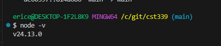
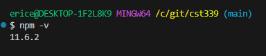
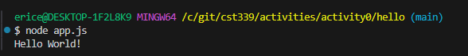
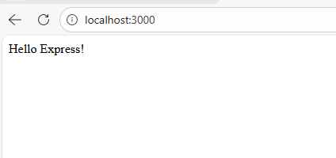
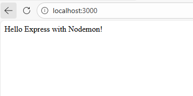
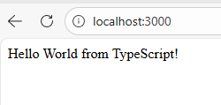
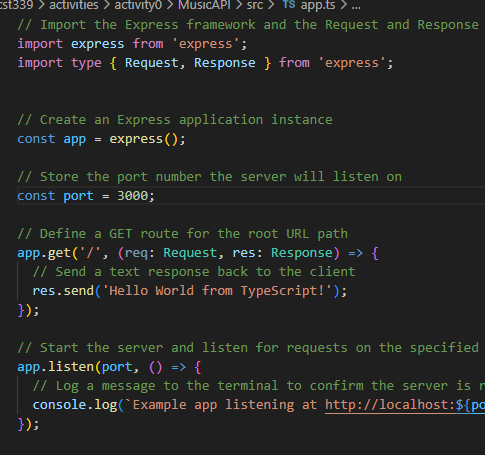

# Activity 0

**GitHub Repository URL:** [Github](https://github.com/EENGSTROM1/cst391.git) 


**Author:** Eric Engstrom  
**Date:** 01 February 2026  

---

## Introduction

This activity installs and validates the tools required to execute a simple Hello World Representational State Transfer (RESTful) Application Programming Interface (API).

The following tools are used in this activity:

- Express backend web application framework for building RESTful APIs  
- NodeJS open source cross platform JavaScript runtime environment  
- Visual Studio Code integrated development environment  
- TypeScript language extension that adds static typing to JavaScript  

Three applications are executed during this activity: a NodeJS console application, an Express web application, and a NodeJS application written in TypeScript.

---

## NodeJS and NPM installation

NodeJS and Node Package Manager (NPM) were installed using the official NodeJS installer for a 64 bit Windows operating system. The installation was validated using the VS Code integrated terminal.

### Node and NPM versions



The following commands were used to validate the installation.

```bash
node -v
npm -v
```

### Results
The displayed version numbers confirm that NodeJS and NPM were installed correctly and are accessible from the VS Code integrated terminal.

---

## NodeJS Hello World application

This step verifies NodeJS can execute a basic JavaScript file from the terminal. A hello folder was created and an app.js file was added with a single console output statement.

### Hello World Console



### Execution
```bash
mkdir hello
cd hello
touch app.js
node app.js
```
```java
console.log("Hello World");
```

### Results
The terminal output displayed the Hello World message, confirming successful execution of the NodeJS console application.

---

## Express Hello World application

This step demonstrates a basic Express based NodeJS web server that responds to HTTP requests. Express was installed using npm and configured to return a simple message to a client.

### Localhost Browser


### Execution

```bash
mkdir helloex
cd helloex
npm init
npm install express
touch app.js
node app.js
```

```java
const express = require('express');
const app = express();
const port = 3000;

app.get('/', (req, res) => res.send('Hello Express!'));

app.listen(port, () => console.log(`Example app listening on port ${port}!`));
```

### Results
The Express application successfully ran on port 3000 and returned the expected response when accessed through a web browser.

---

## Node Monitor (nodemon) utility

The nodemon utility was used to automatically restart the Express server when changes were made to the source code. This removes the need to manually stop and restart the server during development.

### Localhost Browser


### Execution

```bash
npm install -g nodemon
nodemon app.js
nodemon -v
```

### Results
After modifying the Express response and refreshing the browser, the updated output appeared immediately, confirming nodemon restarted the server automatically.

---

## NodeJS with TypeScript Hello TypeScript application

This step creates a NodeJS web service using TypeScript and Express. The MusicAPI folder was initialized with npm, Express was installed, and TypeScript tooling was added to support a typed development workflow.

### NodeJS with Typescript Results




### Setup and execution

```bash
mkdir MusicAPI
cd MusicAPI
npm init
npm i express
npm i --save-dev typescript @types/express
mkdir src
```

```java
// Import the Express framework and the Request and Response types for typing route handlers
import express, { Request, Response } from 'express';

// Create an Express application instance
const app = express();

// Store the port number the server will listen on
const port = 3000;

// Define a GET route for the root URL path
app.get('/', (req: Request, res: Response) => {
  // Send a text response back to the client
  res.send('Hello World from TypeScript!');
});

// Start the server and listen for requests on the specified port
app.listen(port, () => {
  // Log a message to the terminal to confirm the server is running
  console.log(`Example app listening at http://localhost:${port}`);
});
```

### Results
The TypeScript application executed successfully on port 3000 and returned the expected response. The fully commented app.ts file demonstrates understanding of the application structure and server behavior.

---

## Summary
Activity 0 validated the installation and configuration of NodeJS, Express, Visual Studio Code, and TypeScript. The successful execution of a NodeJS console application, an Express web application, and a TypeScript based NodeJS service confirms the development environment is properly configured and ready for future course activities.

---