# Activity 1 MusicAPI

**GitHub Repository URL:** [Github](https://github.com/EENGSTROM1/cst391.git) 

**Author:** Eric Engstrom  
**Course:** CST 391  
**Assignment:** Activity 1
**Date:** February 1, 2026  

---

## Introduction

This activity builds a RESTful backend service using NodeJS, Express, and TypeScript. The MusicAPI demonstrates how to structure an Express application using a Model View Controller architecture while connecting to a MySQL relational database. The API exposes endpoints for albums and artists and uses middleware for logging, security, and request parsing.

---

## Executive Summary

The MusicAPI replaces hard coded responses with live data retrieved from a MySQL database. The application uses environment variables for configuration, a MySQL connection pool for efficiency, and asynchronous request handling to support multiple concurrent users. The project emphasizes clean architecture, separation of concerns, and REST compliant design.

---

---

## Recordings

The following recordings demonstrate the execution and functionality of the MusicAPI application for Activity 1.

Two formats are provided for convenience:

- An online version that can be viewed directly in a web browser
- A downloadable MP4 file that can be viewed locally in a video player

### Activity 1 Online
[[Link to Activity 1 Online Recording](https://www.loom.com/share/b2f626c6c2fe406d8f58e93fecab2b92)]

---


## Technologies Used

| Technology | Purpose |
|-----------|---------|
| NodeJS | JavaScript runtime |
| Express | REST API framework |
| TypeScript | Static typing |
| MySQL | Relational database |
| dotenv | Environment configuration |
| cors | Cross origin requests |
| helmet | Security headers |
| uuid | Request identification |

---

## Project Structure

```text
src
├── albums
│   ├── albums.controller.ts
│   ├── albums.dao.ts
│   ├── albums.model.ts
│   ├── albums.queries.ts
│   └── albums.routes.ts
├── artists
│   ├── artists.controller.ts
│   ├── artists.dao.ts
│   ├── artists.model.ts
│   ├── artists.queries.ts
│   └── artists.routes.ts
├── tracks
│   ├── tracks.dao.ts
│   ├── tracks.model.ts
│   └── tracks.queries.ts
├── middleware
│   └── logger.middleware.ts
├── services
│   └── mysql.connector.ts
└── app.ts
```

---

## Database Overview

The MySQL schema used by this project is named `music`. It contains two tables that store album and track data. Artist information is derived from the albums table rather than being stored in a separate artists table.

| Table Name | Purpose |
|-----------|---------|
| albums | Stores album metadata such as title, artist, year, description, and image |
| tracks | Stores track data associated to albums using an album identifier |

---

## Application Architecture

The MusicAPI follows a Model View Controller approach where routers define routes, controllers handle request and response behavior, and DAOs execute SQL queries through a shared MySQL connector.

| Component | Responsibility |
|----------|----------------|
| Router | Defines endpoint paths and maps HTTP verbs to controller methods |
| Controller | Reads request parameters and body data, calls DAO methods, and returns JSON responses |
| DAO | Executes SQL statements using the shared execute method and passes parameters to queries |
| Model | Provides TypeScript interfaces that match the database fields returned by SQL |
| Queries | Stores SQL statements in a centralized object for reuse and consistency |
| Middleware | Runs between request and response for logging, security headers, and body parsing |
| Services | Contains the MySQL connector and connection pool functionality |

---

## Middleware Configuration

Middleware is registered in `app.ts` and runs in order for each incoming request. The logger captures request timing, while body parsers prepare request data for POST and PUT operations. CORS and Helmet provide cross origin support and security headers.

| Middleware | Purpose |
|-----------|---------|
| Logger | Logs request start, end, status code, and elapsed time |
| express.json | Parses JSON request bodies |
| express.urlencoded | Parses URL encoded request bodies |
| cors | Enables cross origin requests for future frontend clients |
| helmet | Adds security related HTTP response headers |

---

## MySQL Connector

A MySQL connection pool is used to reduce the overhead of creating new database connections for each request. The connector exposes a reusable execute function that returns a Promise so database work does not block the server from handling other requests.

Key behaviors:
1. Pool initializes using environment variables  
2. Pool is reused across requests  
3. execute wraps pool.query in a Promise for async await usage  
4. Errors are centralized and logged consistently  

---

## API Endpoints

The following endpoints were implemented and tested to validate REST functionality and MySQL connectivity.

### Albums

| Method | Endpoint | Description | Inputs |
|------|---------|-------------|--------|
| GET | http://localhost:5000/albums | Returns all albums | None |
| GET | http://localhost:5000/albums?albumId=7 | Returns a single album by ID | Query string albumId |
| GET | http://localhost:5000/albums/artist/:artist | Returns albums by artist name | Path variable artist |
| GET | http://localhost:5000/albums/search/artist/:search | Returns albums matching artist search text | Path variable search |
| GET | http://localhost:5000/albums/search/description/:search | Returns albums matching description search text | Path variable search |
| POST | http://localhost:5000/albums | Creates a new album | JSON body |
| PUT | http://localhost:5000/albums | Updates an album | JSON body |
| DELETE | http://localhost:5000/albums/:albumId | Deletes an album by ID | Path variable albumId |

### Artists

| Method | Endpoint | Description | Inputs |
|------|---------|-------------|--------|
| GET | http://localhost:5000/artists | Returns distinct artist list | None |

---

## Installation and Execution

Run these commands from the MusicAPI project root.

| Command | Purpose |
|--------|---------|
| npm install | Installs dependencies |
| npm run start | Starts server using ts-node |
| npm run start:watch | Starts server using nodemon |

```bash
npm install
npm run start
```

---

## Database Initialization

This activity uses a MySQL relational database named `music` to persist album, artist, and track data for the MusicAPI application. The database schema and seed data were provided as part of the Activity 1 resources and imported using MySQL Workbench.

The database contains two primary tables:

- **albums**: Stores album level information such as title, artist, year, description, and image.
- **tracks**: Stores track level information associated with albums through a foreign key relationship.

The database schema follows a normalized relational design and supports one-to-many relationships between albums and tracks.

---

### EER Diagram 

The following diagram illustrates the structure of the `music` database, including tables, primary keys, and relationships between entities.

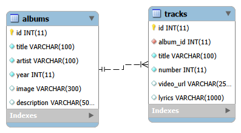

---

### Database Setup Process

The database was initialized using the following steps:

1. Open **MySQL Workbench**
2. Create a new SQL tab
3. Paste the provided database initialization script
4. Execute the script to create the database schema and load sample data
5. Verify that the `music` database and tables were created successfully

Once initialized, the database is accessed by the MusicAPI through environment variables and a MySQL connection pool.

---

## Environment Configuration

The application uses a `.env` file to store environment specific configuration values. This file contains key value pairs that are loaded at runtime using the dotenv library. Storing configuration values in a `.env` file prevents sensitive information from being hard coded into the application source code.

The `.env` file is located at the root of the project.

### .env File Contents

```text
MY_SQL_DB_HOST=127.0.0.1
MY_SQL_DB_USER=root
MY_SQL_DB_PASSWORD=root
MY_SQL_DB_PORT=3306
MY_SQL_DB_DATABASE=music
MY_SQL_DB_CONNECTION_LIMIT=10

PORT=5000
NODE_ENV=development
GREETING=Hello from the environment file. Be kind to the environment!
```

---

## Results
The server started successfully and returned valid JSON responses for albums and artists. The API returned data from the MySQL database rather than hard coded arrays. Middleware logging confirmed that requests were being processed and completed with status codes and timing information.

---

## Conclusion

This activity provided hands-on experience building a full backend RESTful API using Node.js, Express, TypeScript, and MySQL while following a structured Model View Controller (MVC) architecture. I learned how to move from hard-coded data to a persistent relational database by designing data models, creating Data Access Objects (DAOs), and executing parameterized SQL queries through a shared MySQL connection pool. Implementing middleware such as logging, CORS, and security headers reinforced how requests flow through an Express application and how cross-cutting concerns are handled cleanly.

This assignment also strengthened my understanding of asynchronous programming in JavaScript and TypeScript. Using async and await with Promises allowed the server to handle multiple client requests without blocking execution, which is critical for scalable web applications. Additionally, organizing the project into feature-based folders improved readability and maintainability, making the application easier to extend in future activities. Overall, this activity helped bridge theoretical concepts such as REST, MVC, and relational data modeling with real-world implementation.

---

## Troubleshooting

The following table documents issues encountered during development and the steps taken to resolve them.

| Issue | Solution |
|------|---------|
| MySQL error: `ER_NOT_SUPPORTED_AUTH_MODE Client does not support authentication protocol requested by server` | This issue occurred due to a mismatch between the MySQL server authentication method and the Node.js MySQL client. The problem was resolved by creating a new MySQL user configured to use the `mysql_native_password` authentication plugin and granting appropriate privileges. After updating the `.env` file with the new credentials, the application was able to connect successfully. |

```sql
CREATE USER 'sqluser'@'%' IDENTIFIED WITH mysql_native_password BY 'password';
GRANT ALL PRIVILEGES ON *.* TO 'sqluser'@'%';
FLUSH PRIVILEGES;
```

---

## Screenshots and Validation Evidence

The following screenshots document the successful implementation and validation of Activity 1. They demonstrate middleware integration, API routing, MySQL connectivity, application startup, and runtime execution.

All screenshots are located in the following directory:


---

### Middleware Integration

These screenshots validate that custom middleware was implemented and executed correctly, including request logging and middleware configuration.

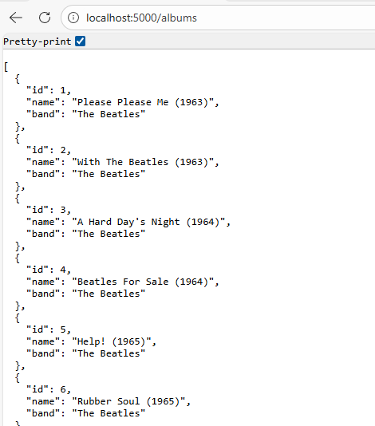

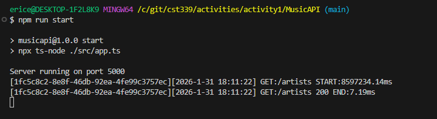

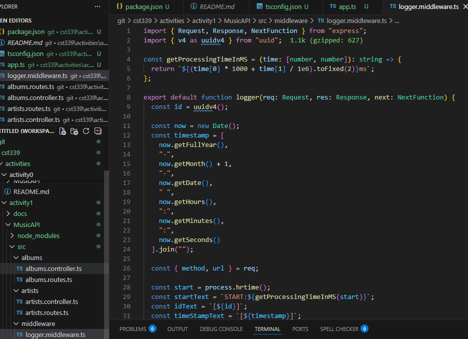

---

### API Routing and Browser Validation

These screenshots confirm that the albums and artists API endpoints are reachable through a web browser and return expected JSON responses.

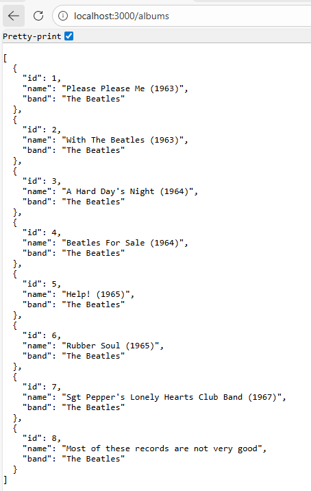

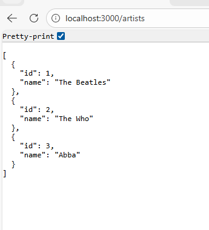

---

### Application Structure and Folder Organization

This screenshot shows the finalized application folder structure following the MVC pattern with routers, controllers, DAOs, models, middleware, and services.

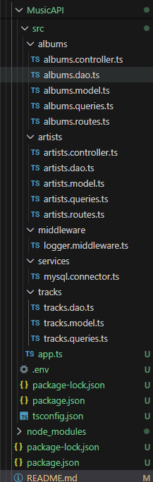

---

### Server Startup and Runtime Execution

These screenshots validate that the server starts successfully, environment variables load correctly, and the application listens on the configured port.

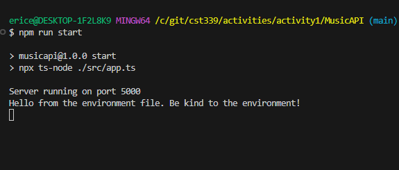

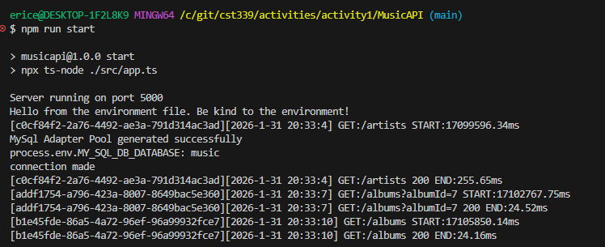

---

### MySQL Configuration and Connectivity

These screenshots confirm correct MySQL environment configuration, dependency setup, and successful database integration.

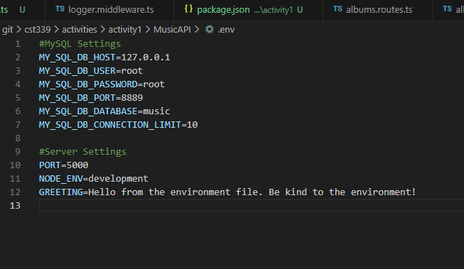

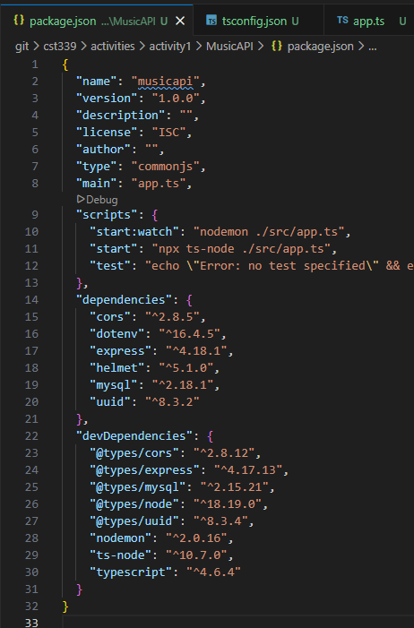

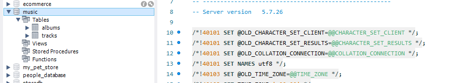

---

### Summary of Validation

The screenshots above collectively demonstrate that:
- Middleware is registered and executed
- API routes respond correctly
- MVC structure is properly implemented
- MySQL is connected using environment variables
- The application runs successfully without runtime errors

---

## Code Implementation

This section documents the primary code artifacts used to build and configure the MusicAPI application. The code is organized by purpose and file type to clearly demonstrate how the application was implemented.

---

### package.json

The package.json file defines the project metadata, dependencies, and scripts used to run the application.

```json
{
  "name": "musicapi",
  "version": "1.0.0",
  "description": "",
  "license": "ISC",
  "author": "",
  "type": "commonjs",
  "main": "app.ts",
  "scripts": {
    "start:watch": "nodemon ./src/app.ts",
    "start": "npx ts-node ./src/app.ts",
    "test": "echo \"Error: no test specified\" && exit 1"
  },
  "dependencies": {
    "cors": "^2.8.6",
    "dotenv": "^16.4.5",
    "express": "^5.2.1",
    "helmet": "^8.1.0",
    "mysql": "^2.18.1",
    "uuid": "^13.0.0"
  },
  "devDependencies": {
    "@types/cors": "^2.8.19",
    "@types/express": "^5.0.6",
    "@types/helmet": "^0.0.48",
    "@types/mysql": "^2.15.27",
    "@types/node": "^22.10.2",
    "@types/uuid": "^10.0.0",
    "ts-node": "^10.9.2",
    "typescript": "^5.9.3"
  }
}
```

### tsconfig.json

```json
{
  "compilerOptions": {
    "target": "es2016",
    "module": "commonjs",
    "moduleResolution": "node",
    "sourceMap": true,
    "noEmitOnError": true,
    "esModuleInterop": true,
    "forceConsistentCasingInFileNames": true,
    "strict": true,
    "skipLibCheck": true
  },
  "include": ["src/**/*.ts"]
}
```

### app.ts

```ts
import express from "express";
import dotenv from "dotenv";
import cors from "cors";
import helmet from "helmet";

import logger from "./middleware/logger.middleware";
import albumsRouter from "./albums/albums.routes";
import artistsRouter from "./artists/artists.routes";

dotenv.config();

const app = express();
const port = process.env.PORT || 5000;

// logger middleware
app.use(logger);

// Parse JSON bodies
app.use(express.json());

// Parse URL encoded bodies
app.use(express.urlencoded({ extended: true }));

// Allow cross origin requests
app.use(cors());

// Security headers
app.use(helmet());

// Routers
app.use("/", [albumsRouter, artistsRouter]);

app.listen(port, () => {
  console.log(`Server running on port ${port}`);
  console.log(process.env.GREETING);
});

```

### logger.middleware.ts

``` ts
import { Request, Response, NextFunction } from "express";
import { v4 as uuidv4 } from "uuid";

const getProcessingTimeInMS = (time: [number, number]): string => {
  return `${(time[0] * 1000 + time[1] / 1e6).toFixed(2)}ms`;
};

export default function logger(req: Request, res: Response, next: NextFunction) {
  const id = uuidv4();

  const now = new Date();
  const timestamp = [
    now.getFullYear(),
    "-",
    now.getMonth() + 1,
    "-",
    now.getDate(),
    " ",
    now.getHours(),
    ":",
    now.getMinutes(),
    ":",
    now.getSeconds()
  ].join("");

  const { method, url } = req;

  const start = process.hrtime();
  const startText = `START:${getProcessingTimeInMS(start)}`;
  const idText = `[${id}]`;
  const timeStampText = `[${timestamp}]`;

  console.log(`${idText}${timeStampText} ${method}:${url} ${startText}`);

  res.once("finish", () => {
    const end = process.hrtime(start);
    const endText = `END:${getProcessingTimeInMS(end)}`;
    console.log(`${idText}${timeStampText} ${method}:${url} ${res.statusCode} ${endText}`);
  });

  next();
}
```

### mysql.connector.ts
```ts
import { createPool, Pool } from "mysql";

let pool: Pool | null = null;

const initializeMySqlConnector = () => {
  try {
    pool = createPool({
      connectionLimit: parseInt(
        process.env.MY_SQL_DB_CONNECTION_LIMIT !== undefined
          ? process.env.MY_SQL_DB_CONNECTION_LIMIT
          : "10"
      ),
      port: parseInt(
        process.env.MY_SQL_DB_PORT !== undefined ? process.env.MY_SQL_DB_PORT : "3306"
      ),
      host: process.env.MY_SQL_DB_HOST,
      user: process.env.MY_SQL_DB_USER,
      password: process.env.MY_SQL_DB_PASSWORD,
      database: process.env.MY_SQL_DB_DATABASE
    });

    console.debug("MySql Adapter Pool generated successfully");
    console.log("process.env.MY_SQL_DB_DATABASE:", process.env.MY_SQL_DB_DATABASE);

    pool.getConnection((err, connection) => {
      if (err) {
        console.log("error mysql failed to connect");
        throw new Error("not able to connect to database");
      } else {
        console.log("connection made");
        connection.release();
      }
    });
  } catch (error) {
    console.error("[mysql.connector][initializeMySqlConnector][Error]: ", error);
    throw new Error("failed to initialize pool");
  }
};

export const execute = <T>(query: string, params: string[] | Object): Promise<T> => {
  try {
    if (!pool) {
      initializeMySqlConnector();
    }

    return new Promise<T>((resolve, reject) => {
      pool!.query(query, params, (error, results) => {
        if (error) reject(error);
        else resolve(results);
      });
    });
  } catch (error) {
    console.error("[mysql.connector][execute][Error]: ", error);
    throw new Error("failed to execute MySQL query");
  }
};
```

### albums.controller.ts
```ts
import { Request, RequestHandler, Response } from "express";
import { OkPacket } from "mysql";
import { Album } from "./albums.model";
import { Track } from "../tracks/tracks.model";
import * as AlbumDao from "./albums.dao";
import * as TracksDao from "../tracks/tracks.dao";

export const readAlbums: RequestHandler = async (req: Request, res: Response) => {
  try {
    let albums: Album[];
    const albumId = parseInt(req.query.albumId as string);

    if (Number.isNaN(albumId)) {
      albums = await AlbumDao.readAlbums();
    } else {
      albums = await AlbumDao.readAlbumsByAlbumId(albumId);
    }

    await readTracks(albums, res);
    res.status(200).json(albums);
  } catch (error) {
    console.error("[albums.controller][readAlbums][Error] ", error);
    res.status(500).json({ message: "There was an error when fetching albums" });
  }
};

export const readAlbumsByArtist: RequestHandler = async (req: Request, res: Response) => {
  try {
    const albums = await AlbumDao.readAlbumsByArtist(req.params.artist);
    await readTracks(albums, res);
    res.status(200).json(albums);
  } catch (error) {
    console.error("[albums.controller][readAlbumsByArtist][Error] ", error);
    res.status(500).json({ message: "There was an error when fetching albums" });
  }
};

export const readAlbumsByArtistSearch: RequestHandler = async (req: Request, res: Response) => {
  try {
    const search = `%${req.params.search}%`;
    const albums = await AlbumDao.readAlbumsByArtistSearch(search);
    await readTracks(albums, res);
    res.status(200).json(albums);
  } catch (error) {
    console.error("[albums.controller][readAlbumsByArtistSearch][Error] ", error);
    res.status(500).json({ message: "There was an error when fetching albums" });
  }
};

export const readAlbumsByDescriptionSearch: RequestHandler = async (
  req: Request,
  res: Response
) => {
  try {
    const search = `%${req.params.search}%`;
    const albums = await AlbumDao.readAlbumsByDescriptionSearch(search);
    await readTracks(albums, res);
    res.status(200).json(albums);
  } catch (error) {
    console.error("[albums.controller][readAlbumsByDescriptionSearch][Error] ", error);
    res.status(500).json({ message: "There was an error when fetching albums" });
  }
};

export const createAlbum: RequestHandler = async (req: Request, res: Response) => {
  try {
    const okPacket: OkPacket = await AlbumDao.createAlbum(req.body);

    if (req.body.tracks && Array.isArray(req.body.tracks)) {
      req.body.tracks.forEach(async (track: Track, index: number) => {
        try {
          await TracksDao.createTrack(track, index, okPacket.insertId);
        } catch (error) {
          console.error("[albums.controller][createAlbumTracks][Error] ", error);
          res.status(500).json({ message: "There was an error when writing album tracks" });
        }
      });
    }

    res.status(200).json(okPacket);
  } catch (error) {
    console.error("[albums.controller][createAlbum][Error] ", error);
    res.status(500).json({ message: "There was an error when writing albums" });
  }
};

export const updateAlbum: RequestHandler = async (req: Request, res: Response) => {
  try {
    const okPacket: OkPacket = await AlbumDao.updateAlbum(req.body);

    if (req.body.tracks && Array.isArray(req.body.tracks)) {
      req.body.tracks.forEach(async (track: Track) => {
        try {
          await TracksDao.updateTrack(track);
        } catch (error) {
          console.error("[albums.controller][updateAlbumTracks][Error] ", error);
          res.status(500).json({ message: "There was an error when updating album tracks" });
        }
      });
    }

    res.status(200).json(okPacket);
  } catch (error) {
    console.error("[albums.controller][updateAlbum][Error] ", error);
    res.status(500).json({ message: "There was an error when updating albums" });
  }
};

const readTracks = async (albums: Album[], res: Response) => {
  try {
    for (let i = 0; i < albums.length; i++) {
      const tracks = await TracksDao.readTracksByAlbumId(albums[i].albumId);
      albums[i].tracks = tracks;
    }
  } catch (error) {
    console.error("[albums.controller][readTracks][Error] ", error);
    res.status(500).json({ message: "There was an error when fetching album tracks" });
  }
};

export const deleteAlbum: RequestHandler = async (req: Request, res: Response) => {
  try {
    const albumId = parseInt(req.params.albumId as string);

    if (Number.isNaN(albumId)) {
      throw new Error("Integer expected for albumId");
    }

    const response = await AlbumDao.deleteAlbum(albumId);
    res.status(200).json(response);
  } catch (error) {
    console.error("[albums.controller][deleteAlbum][Error] ", error);
    res.status(500).json({ message: "There was an error when deleting albums" });
  }
};
```

### albums.dao.ts
```ts
import { OkPacket } from "mysql";
import { execute } from "../services/mysql.connector";
import { Album } from "./albums.model";
import { albumQueries } from "./albums.queries";

export const readAlbums = async () => {
  return execute<Album[]>(albumQueries.readAlbums, []);
};

export const readAlbumsByAlbumId = async (albumId: number) => {
  return execute<Album[]>(albumQueries.readAlbumsByAlbumId, [albumId]);
};

export const readAlbumsByArtist = async (artistName: string) => {
  return execute<Album[]>(albumQueries.readAlbumsByArtist, [artistName]);
};

export const readAlbumsByArtistSearch = async (search: string) => {
  return execute<Album[]>(albumQueries.readAlbumsByArtistSearch, [search]);
};

export const readAlbumsByDescriptionSearch = async (search: string) => {
  return execute<Album[]>(albumQueries.readAlbumsByDescriptionSearch, [search]);
};

export const createAlbum = async (album: Album) => {
  return execute<OkPacket>(albumQueries.createAlbum, [
    album.title,
    album.artist,
    album.description,
    album.year,
    album.image
  ]);
};

export const updateAlbum = async (album: Album) => {
  return execute<OkPacket>(albumQueries.updateAlbum, [
    album.title,
    album.artist,
    album.year,
    album.image,
    album.description,
    album.albumId
  ]);
};

export const deleteAlbum = async (albumId: number) => {
  return execute<OkPacket>(albumQueries.deleteAlbum, [albumId]);
};
```

### albums.model.ts
```ts
import { Track } from "../tracks/tracks.model";

export interface Album {
  albumId: number;
  artist: string;
  title: string;
  description: string;
  year: number;
  image: string;
  tracks?: Track[];
}
```

### albums.queries.ts
```ts
export const albumQueries = {
  readAlbums: `
    SELECT
      id as albumId, title AS title, artist AS artist,
      description AS description, year AS year, image AS image
    FROM music.albums
  `,
  readAlbumsByArtist: `
    SELECT
      id as albumId, title AS title, artist AS artist,
      description AS description, year AS year, image AS image
    FROM music.albums
    WHERE music.albums.artist = ?
  `,
  readAlbumsByArtistSearch: `
    SELECT
      id as albumId, title AS title, artist AS artist,
      description AS description, year AS year, image AS image
    FROM music.albums
    WHERE music.albums.artist LIKE ?
  `,
  readAlbumsByDescriptionSearch: `
    SELECT
      id as albumId, title AS title, artist AS artist,
      description AS description, year AS year, image AS image
    FROM music.albums
    WHERE music.albums.description LIKE ?
  `,
  readAlbumsByAlbumId: `
    SELECT
      id as albumId, title AS title, artist AS artist,
      description AS description, year AS year, image AS image
    FROM music.albums
    WHERE music.albums.id = ?
  `,
  createAlbum: `
    INSERT INTO music.albums(title, artist, description, year, image)
    VALUES(?,?,?,?,?)
  `,
  updateAlbum: `
    UPDATE music.albums
    SET title = ?, artist = ?, year = ?, image = ?, description = ?
    WHERE id = ?
  `,
  deleteAlbum: `
    DELETE FROM music.albums
    WHERE id = ?
  `
};
```

### albums.routes.ts
```ts
import { Router } from "express";
import * as AlbumsController from "./albums.controller";

const router = Router();

router.route("/albums").get(AlbumsController.readAlbums);

router.route("/albums/:artist").get(AlbumsController.readAlbumsByArtist);

router.route("/albums/search/artist/:search").get(AlbumsController.readAlbumsByArtistSearch);

router
  .route("/albums/search/description/:search")
  .get(AlbumsController.readAlbumsByDescriptionSearch);

router.route("/albums").post(AlbumsController.createAlbum);

router.route("/albums").put(AlbumsController.updateAlbum);

router.route("/albums/:albumId").delete(AlbumsController.deleteAlbum);

export default router;
```

### artists.controller.ts
```ts
import { Request, RequestHandler, Response } from "express";
import * as ArtistsDao from "./artists.dao";

export const readArtists: RequestHandler = async (req: Request, res: Response) => {
  try {
    const artists = await ArtistsDao.readArtists();
    res.status(200).json(artists);
  } catch (error) {
    console.error("[artists.controller][readArtists][Error] ", error);
    res.status(500).json({
      message: "There was an error when fetching artists"
    });
  }
};
```

### artists.dao.ts
```ts
import { execute } from "../services/mysql.connector";
import { Artist } from "./artists.model";
import { artistQueries } from "./artists.queries";

export const readArtists = async () => {
  return execute<Artist[]>(artistQueries.readArtists, []);
};
```

### artists.model.ts
```ts
export interface Artist {
  artist: string;
}
```

### artists.queries.ts
```ts
export const artistQueries = {
  readArtists: `
    SELECT DISTINCT artist AS artist
    FROM music.albums
  `
};
```

### artists.routes.ts
```ts
import { Router } from "express";
import * as ArtistsController from "./artists.controller";

const router = Router();

router.route("/artists").get(ArtistsController.readArtists);

export default router;
```

### tracks.dao.ts
```ts
import { execute } from "../services/mysql.connector";
import { Track } from "./tracks.model";
import { trackQueries } from "./tracks.queries";

export const readTracksByAlbumId = async (albumId: number) => {
  return execute<Track[]>(trackQueries.readTracksByAlbumId, [albumId]);
};

export const createTrack = async (track: Track, index: number, albumId: number) => {
  return execute<Track[]>(trackQueries.createTrack, [
    albumId,
    track.title,
    index,
    track.video,
    track.lyrics
  ]);
};

export const updateTrack = async (track: Track) => {
  return execute<Track[]>(trackQueries.updateTrack, [
    track.title,
    track.number,
    track.video,
    track.lyrics,
    track.trackId
  ]);
};
```

### tracks.model.ts
```ts
export interface Track {
  trackId: number;
  title: string;
  number: number;
  video: string;
  lyrics: string;
}
```

### tracks.queries.ts
```ts 
export const trackQueries = {
  createTrack: `
    INSERT INTO music.tracks (album_id, title, number, video_url, lyrics)
    VALUES(?,?,?,?,?)
  `,
  readTracksByAlbumId: `
    SELECT
      id as trackId,
      title as title,
      number as number,
      video_url as video,
      lyrics as lyrics
    FROM music.tracks
    WHERE album_id = ?
  `,
  updateTrack: `
    UPDATE music.tracks
    SET title = ?, number = ?, video_url = ?, lyrics = ?
    WHERE id = ?
  `
};
```

---