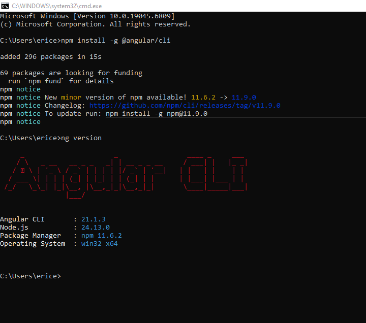
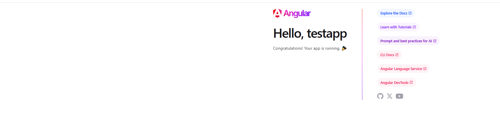
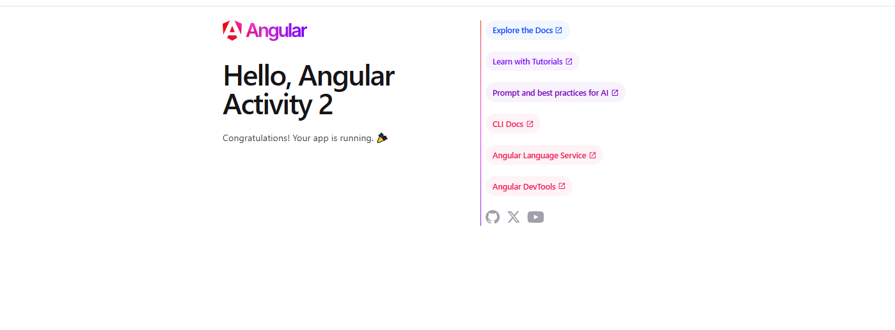
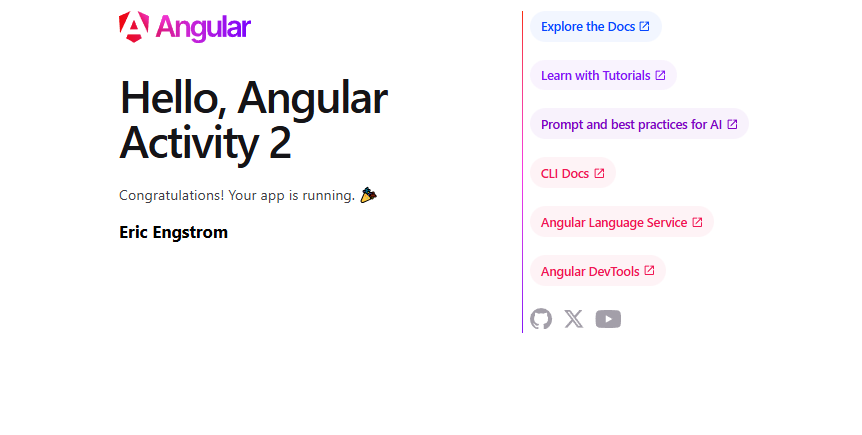

# Activity 2 

**GitHub Repository URL:** [Github](https://github.com/EENGSTROM1/cst391.git) 

**Author:** Eric Engstrom  
**Course:** CST 391  
**Assignment:** Activity 2
**Date:** February 8, 2026  

---
## Introduction

Angular is a modern front end framework built on TypeScript that is commonly used to develop single page web applications. The purpose of this activity was to install the Angular Command Line Interface, verify that the required tools were configured correctly, and validate the environment by creating and running a simple Angular application. This activity also demonstrated how Angular components work and how changes made in the code are automatically reflected in the browser during development.

## Activity 2 Commands

- Install the latest version of Angular

```
npm install -g @angular/cli@latest
```

- Display the Angular Version

```
ng version
```

- Create a new Angular project, this case we will call testapp

```
ng new testapp
```

- Change directory to the new project and start the server

```
cd testapp
ng serve
```


## Application Validation

Once the development server was started, the Angular application launched automatically in the browser, confirming that the environment was set up correctly. The main component was modified by changing the title value, and the browser refreshed automatically after saving the file, demonstrating Angular live reload behavior.

A new component variable named message was then added and rendered in an h3 HTML tag within the application template. This confirmed that component logic and template data binding were functioning properly.

## Test Links

http://localhost:4200

## Screenshots

### Angular Version Verification


### Angular Application Running in Browser


### Updated Title in Application


### Message Variable Rendered


---

## Conclusion

This activity successfully validated the Angular development environment by installing the Angular CLI, creating a test application, and running it locally. Making changes to the component and immediately seeing them reflected in the browser reinforced how Angular handles components and data binding. This activity provided a strong foundation for future Angular development in upcoming milestones.

## Troubleshooting

<table>
  <tr>
    <th>Issue</th>
    <th>Solution</th>
  </tr>
  <tr>
    <td>Angular command not recognized</td>
    <td>Verify Angular CLI is installed globally and restart the terminal</td>
  </tr>
  <tr>
    <td>Application does not load</td>
    <td>Confirm the development server is running and navigate to localhost:4200</td>
  </tr>
  <tr>
    <td>Changes not updating</td>
    <td>Ensure files are saved and the server is still running</td>
  </tr>
</table>

---

## Research question

### a. Angular Project Structure and Configuration Files

The **node_modules** folder contains all third party libraries and dependencies that are required for the Angular application to run. These dependencies are managed by npm and are defined in the package.json file. This folder is automatically generated and is not typically modified manually.

The **src** folder contains all of the source code for the Angular application. This is where the main application logic, components, styles, and configuration files used at runtime are stored.

The **src/app** folder holds the core application code, including the root component and any additional components, routes, and application level logic. This folder represents the main functional area of the Angular application.

The **src/assets** folder is used to store static files such as images, icons, or other resources that need to be available to the application without being processed by Angular.

The **src/environments** folder contains environment specific configuration files, such as development and production settings. These files allow Angular to switch configuration values depending on how the application is built or deployed.

The **angular.json** file defines the overall project configuration for Angular, including build options, assets, styles, and scripts. It tells Angular how to compile and serve the application.

The **package.json** file manages project metadata, dependencies, and npm scripts. It defines which libraries are required for the application and allows npm to install and manage them.

The **tsconfig.json** file controls how TypeScript code is compiled into JavaScript. It defines compiler options such as target JavaScript version, module resolution, and strictness rules.

---

### b. Angular Page Generation and Core Application Files

The **main.ts** file serves as the entry point of the Angular application. It is responsible for bootstrapping the application and loading the root component when the application starts.

The **app.component.ts** file contains the logic for the root component. It defines the component metadata, variables, and behavior that control what data is displayed in the view.

The **app.component.html** file is the template for the root component. It defines the HTML structure that is rendered in the browser and uses Angular binding syntax to display data from the component class.

The **app.component.css** file provides styling specific to the root component. These styles are scoped to the component and help control the appearance of the rendered page.

The **app.module.ts** file traditionally defines the root Angular module and registers components and dependencies. In newer Angular versions using standalone components, this file may be replaced or simplified, but its role is still to organize how the application is assembled and initialized.

Together, these files demonstrate how Angular separates application logic, presentation, and configuration while working together to generate the final page displayed in the browser.
