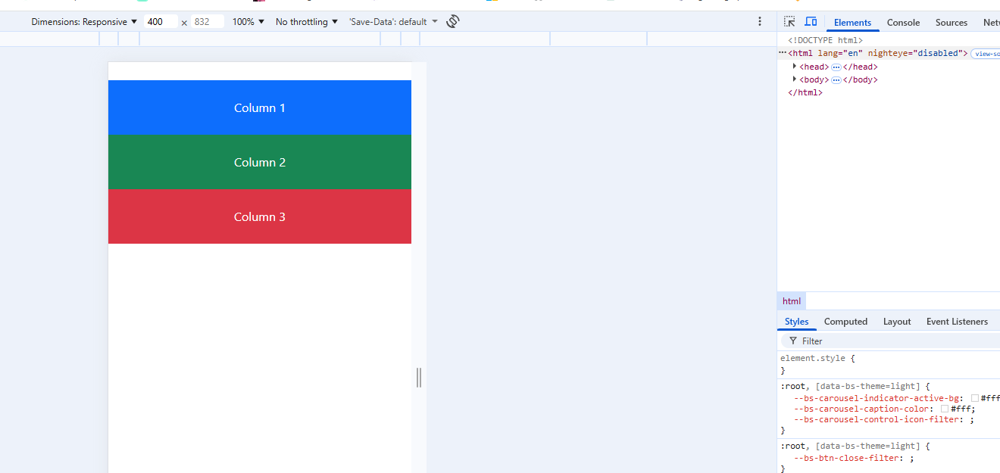
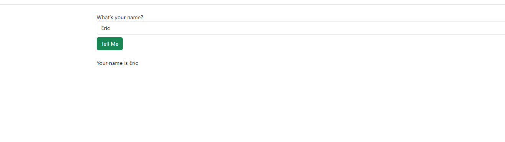
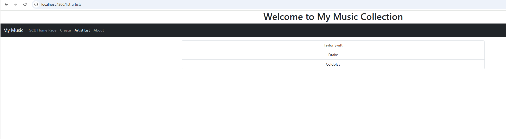
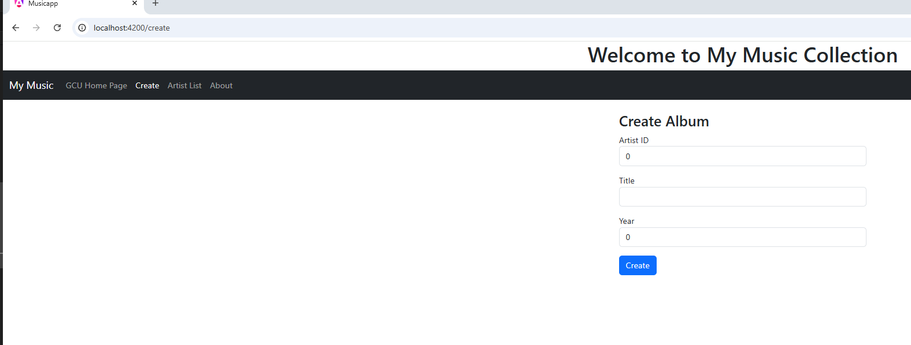
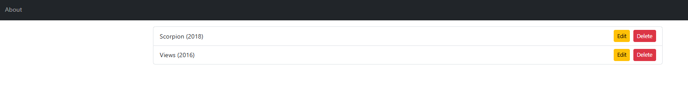
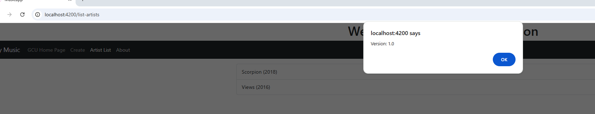

# Activity 3 

**GitHub Repository URL:** [Github](https://github.com/EENGSTROM1/cst391.git) 

**Author:** Eric Engstrom  
**Course:** CST 391  
**Date:** February 15, 2026  

---

## Activity 3 – Part 1


## Introduction

In Part 1 of Activity 3, I built a structured Angular application that demonstrates component creation, event handling, property binding, two way data binding, conditional rendering, and Bootstrap responsive layout. The application consists of a Shop component using Reactive Forms and an Info component using Template Driven Forms.

This activity reinforced how Angular components communicate with each other and how form strategies differ in Angular development.

---

# Application Setup

## Create Angular Application

```bash
ng new simpleapp
```

Options selected:

- CSS
- No Server Side Rendering
- No AI configuration

---

## Navigate to Project

```bash
cd simpleapp
```

---

## Start Development Server

```bash
ng serve --o
```

---

# Bootstrap Installation

## Install Bootstrap and Popper

```bash
npm install bootstrap
npm install @popperjs/core
```

---

## Update angular.json

Added to styles array:

```json
"node_modules/bootstrap/dist/css/bootstrap.css"
```

Added to scripts array:

```json
"node_modules/bootstrap/dist/js/bootstrap.bundle.js"
```

---

# Bootstrap Grid Implementation

## app.html

```html
<div class="container mt-4">
  <div class="row">
    <div class="col-md-4 bg-primary text-white p-4 text-center">
      Column 1
    </div>
    <div class="col-md-4 bg-success text-white p-4 text-center">
      Column 2
    </div>
    <div class="col-md-4 bg-danger text-white p-4 text-center">
      Column 3
    </div>
  </div>
</div>
```

---

## Desktop View


**Caption:**  
Three equal width columns are displayed side by side using Bootstrap’s grid system.

---

## Mobile View



**Caption:**  
Columns stack vertically when switching to mobile device emulation in Chrome DevTools.

---

# Create Shop Component

## Generate Component

```bash
ng generate component shop
```

---

## shop.ts

```ts
import { Component } from '@angular/core';
import { ReactiveFormsModule, FormGroup, FormControl } from '@angular/forms';
import { CommonModule } from '@angular/common';
import { InfoComponent } from '../info/info';

@Component({
  selector: 'app-shop',
  standalone: true,
  imports: [
    CommonModule,
    ReactiveFormsModule,
    InfoComponent
  ],
  templateUrl: './shop.html',
  styleUrl: './shop.css'
})
export class Shop {

  question: string = "What’s your name?";
  answer: string = "unknown";

  appForm = new FormGroup({
    answer: new FormControl('')
  });

  onSubmit(data: Partial<{ answer: string | null }>) {
    this.answer = data.answer ?? '';
    console.log("Your name is " + this.answer);
  }
}
```

---

## shop.html

```html
<div class="container mt-4">

  <form [formGroup]="appForm" (ngSubmit)="onSubmit(appForm.value)">
    <div class="form-group">
      <label>{{question}}</label>
      <input type="text" class="form-control" formControlName="answer">
    </div>
    <button type="submit" class="btn btn-success mt-2">Tell Me</button>
  </form>

  <br/>

  <label *ngIf="answer != 'unknown'">
    Your name is {{answer}}
  </label>

  <app-info 
    [name]="answer" 
    *ngIf="answer != 'unknown'">
  </app-info>

</div>
```

---

# Create Info Component

## Generate Component

```bash
ng generate component info
```

---

## info.ts

```ts
import { Component, OnInit, Input } from '@angular/core';
import { CommonModule } from '@angular/common';
import { FormsModule } from '@angular/forms';

@Component({
  selector: 'app-info',
  standalone: true,
  imports: [CommonModule, FormsModule],
  templateUrl: './info.html',
  styleUrl: './info.css'
})
export class InfoComponent implements OnInit {

  @Input() name: string = '';

  quantity = 0;
  products: string[] = [];
  selectedProduct = '';

  ngOnInit() {
    this.quantity = 0;
    this.products = ["Star Wars", "The Empire Strikes Back", "Return of the Jedi"];
    this.selectedProduct = "Star Wars";
  }

  newInfo() {
    this.quantity = 0;
    this.selectedProduct = "Star Wars";
    console.log("In newInfo() and resetting Info");
  }

  onSubmit() {
    console.log(
      "In onSubmit() with quantity of " + 
      this.quantity + 
      " and Movie selected is " + 
      this.selectedProduct
    );
  }
}
```

---

## info.html

```html
<div class="container mt-4">

  <h4>Welcome {{name}}, please place your Order</h4>

  <form (ngSubmit)="onSubmit()" #infoForm="ngForm">

    <div class="form-group">
      <label for="quantity">Quantity</label>
      <input type="text"
             class="form-control"
             id="quantity"
             required
             [(ngModel)]="quantity"
             name="quantity">
    </div>

    <div class="form-group mt-2">
      <label for="products">Star Wars Movies</label>
      <select class="form-control"
              id="products"
              required
              [(ngModel)]="selectedProduct"
              name="products">
        <option *ngFor="let product of products"
                [value]="product">
          {{product}}
        </option>
      </select>
    </div>

    <button type="submit" class="btn btn-success mt-3">Buy</button>
    <button type="button"
            class="btn btn-secondary mt-3 ms-2"
            (click)="newInfo()">Reset</button>

  </form>

</div>
```

---

# Application Screenshots

## Initial State


---

## After Name Entered



---

## DevTools Console Output


---

# Research Questions

## 1. Describe the @Input decorator used in info.component.ts

The `@Input` decorator is used in Angular to allow a child component to receive data from a parent component. It enables property binding between components and supports one way data flow from parent to child. In this application, the Shop component passes the `answer` property into the Info component using the syntax:

```html
<app-info [name]="answer"></app-info>
```

The Info component declares:

```ts
@Input() name: string;
```

This tells Angular that the `name` property can receive external data. When the value of `answer` changes in the Shop component, Angular automatically updates the `name` property in the Info component. This mechanism allows components to remain reusable and loosely coupled while still communicating efficiently. The `@Input` decorator is a fundamental concept in Angular component architecture because it supports clean separation of concerns and scalable application design.

---

## 2. Describe [value] used in info.component.html

The `[value]` syntax in Angular represents property binding. Property binding allows a component property to be bound to an HTML element attribute dynamically. In this activity, `[value]="product"` is used inside the `option` element of a select dropdown:

```html
<option *ngFor="let product of products" [value]="product">
  {{product}}
</option>
```

Here, Angular binds each element of the `products` array to the value attribute of the option tag. Instead of hardcoding values in HTML, the dropdown is dynamically generated from the component’s data. This ensures that the selected option corresponds directly to the data model. Property binding improves maintainability because changes to the data array automatically update the user interface without modifying the HTML structure.

---

## 3. Describe [(ngModel)] used in info.component.html

The `[(ngModel)]` syntax represents two way data binding in Angular. It is a combination of property binding and event binding wrapped into one expression. The square brackets bind data from the component to the view, and the parentheses listen for changes from the view back to the component. Together, they keep both sides synchronized.

In this application, `[(ngModel)]` is used for the quantity input field and the selected product dropdown:

```html
<input [(ngModel)]="quantity" name="quantity">
<select [(ngModel)]="selectedProduct" name="products">
```

When a user types into the input field or selects a movie from the dropdown, the corresponding component property updates immediately. If the component changes the value programmatically, the UI updates automatically as well. This real time synchronization simplifies form handling and reduces the amount of manual event handling code required. Two way data binding is especially useful in template driven forms because it creates a direct connection between the view and the component model.

---

## Conclusion

This activity strengthened my understanding of Angular component structure, data binding, and form strategies. I implemented both Reactive Forms and Template Driven Forms, used conditional rendering with ngIf, and passed data between components using the @Input decorator. I also verified responsiveness using Bootstrap and Chrome DevTools. Overall, this assignment reinforced core Angular concepts required for scalable frontend development.

---
# Activity 3 – Part 2


## Introduction

This assignment focused on developing the full front end of the Music Application using Angular. The application builds upon the foundational work from Part 1 and introduces multiple standalone components, routing with parameters, component communication using `@Input`, and a centralized Angular service that acts as a façade for accessing mock JSON data.  

The goal of this activity was to simulate a real client-server architecture while using local JSON data instead of a live API. The application now supports navigation between pages, dynamic rendering of artists and albums, and full CRUD operations including creating, editing, and deleting albums. Bootstrap was integrated to provide responsive layout and professional styling across desktop and mobile views.  

This project demonstrates how Angular components interact through routing and services while maintaining separation of concerns between UI logic and data access logic.

---


## Music App Deliverables



### Captioned Screenshots

---

### Initial Application Page  

The initial page loads the Bootstrap navigation bar and redirects automatically to the Artist List route. The application title is displayed at the top of the page and the navbar includes navigation links for Create, Artist List, About, and the external GCU homepage. Routing is handled using Angular’s `routerLink` directive rather than traditional anchor tags.

---

### GCU Homepage  


The GCU Home Page link opens an external site in a new browser tab. This verifies proper separation between internal Angular routing and external navigation using a standard `href` attribute with `target="_blank"`.

---

### Create Album Page  
  

The Create Album component allows the user to input album details and submit the form. When submitted, the album is pushed into the service’s albums array and immediately becomes available in the Artist List view. This confirms the service is functioning as a centralized data manager.

---

### Artist List Page Showing Added Album  


The Artist List component displays artists retrieved from the MusicService. When an artist is selected, the List Albums component loads dynamically using `@Input` to receive the selected artist. Newly created albums appear immediately, demonstrating proper service integration and Angular change detection.

---

### About Box  
 

The About link in the navbar triggers a function that displays a JavaScript alert containing the application version. This confirms event binding from the template to the component class is functioning properly.

---

## Music Service Implementation (Research)

The Music Service acts as a façade between the Angular components and the mock JSON file. It centralizes all CRUD logic so components never directly manipulate the data source. This improves maintainability and prepares the application for future backend API integration.

Below is the fully commented service implementation required for the research portion.

```ts
import { Injectable } from '@angular/core';

import * as exampledata from '../../data/sample-music-data.json';

import { Artist } from '../../models/artists.model';
import { Album } from '../../models/albums.model';

/**
 * MusicService
 * 
 * This service provides a centralized interface for accessing
 * artist and album data. It abstracts the data source from the UI
 * components and acts as a façade layer.
 */
@Injectable({
  providedIn: 'root'
})
export class MusicService {

  /**
   * Array of artists loaded from the mock JSON file.
   */
  artists: Artist[] = (exampledata as any).artists;

  /**
   * Array of albums loaded from the mock JSON file.
   */
  albums: Album[] = (exampledata as any).albums;

  constructor() { }

  /**
   * Returns the complete list of artists.
   */
  public getArtists(): Artist[] {
    return this.artists;
  }

  /**
   * Returns albums that match a specific artistId.
   */
  public getAlbums(artistId: number): Album[] {
    return this.albums.filter(a => a.artistId === artistId);
  }

  /**
   * Returns a single album based on artistId and album ID.
   */
  public getAlbum(artistId: number, id: number): Album | null {
    const found = this.albums.find(
      a => a.artistId === artistId && a.id === id
    );
    return found ? found : null;
  }

  /**
   * Adds a new album to the albums collection.
   */
  public createAlbum(album: Album): number {
    try {
      this.albums.push(album);
      return album.id;
    } catch {
      return -1;
    }
  }

  /**
   * Updates an existing album by locating it via ID.
   */
  public updateAlbum(album: Album): number {
    const index = this.albums.findIndex(a => a.id === album.id);

    if (index !== -1) {
      this.albums.splice(index, 1, album);
      return 0;
    }

    return -1;
  }

  /**
   * Deletes an album using album ID and artist ID.
   */
  public deleteAlbum(id: number, artistId: number): number {
    const index = this.albums.findIndex(
      a => a.id === id && a.artistId === artistId
    );

    if (index !== -1) {
      this.albums.splice(index, 1);
      return 0;
    }

    return -1;
  }
}
```

---

## Conclusion

This activity significantly improved my understanding of Angular component interaction and service architecture. I learned how to structure an application using standalone components while maintaining separation between presentation logic and data logic. Implementing routing with parameters helped me understand how Angular handles navigation state and dynamic rendering.  

The Music Service reinforced the importance of abstraction layers, especially when preparing an application for backend integration. I also gained practical experience using Bootstrap within Angular and troubleshooting common binding and routing errors. Overall, this assignment strengthened my ability to build modular, scalable front-end applications using Angular.

---

## Troubleshooting

| Issue | Solution |
|-------|----------|
| routerLink not working | Import `RouterModule` inside standalone component imports array |
| JSON file not importing | Enable `"resolveJsonModule": true` in tsconfig |
| @Input not recognized | Ensure child component is added to `imports` array |
| Route not loading | Confirm route exists in `app.routes.ts` and default redirect is configured |

