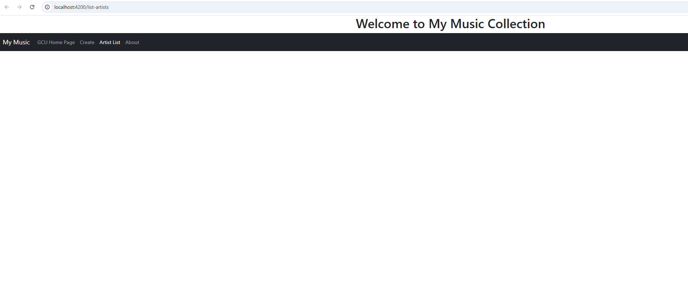
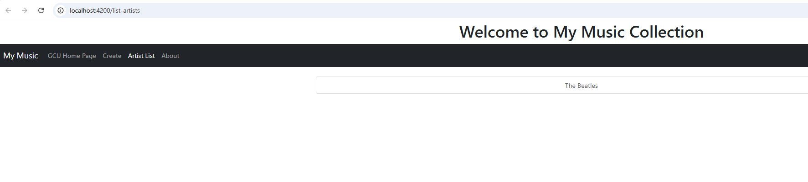
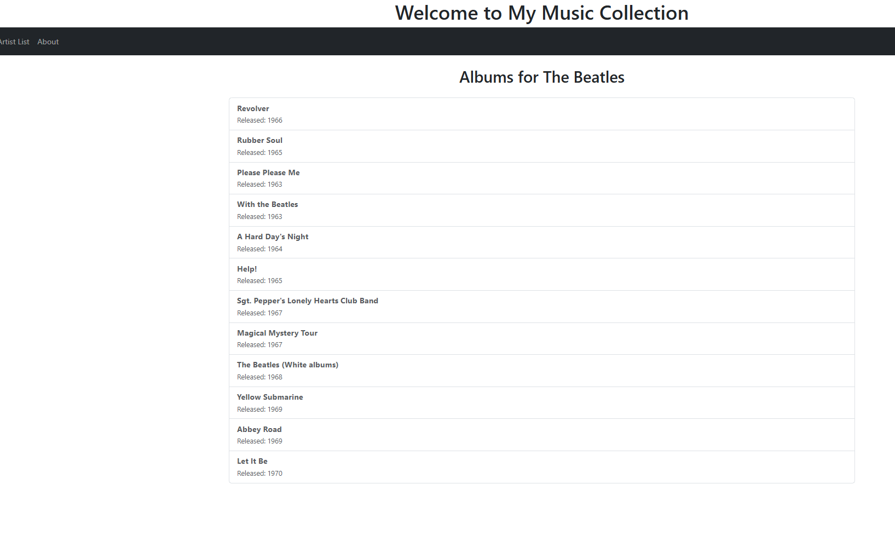
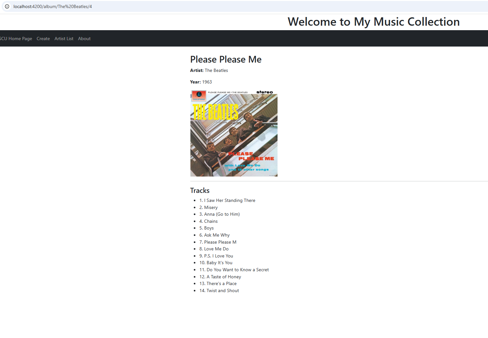
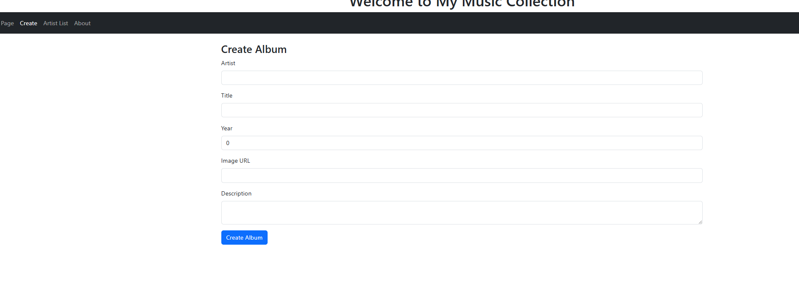
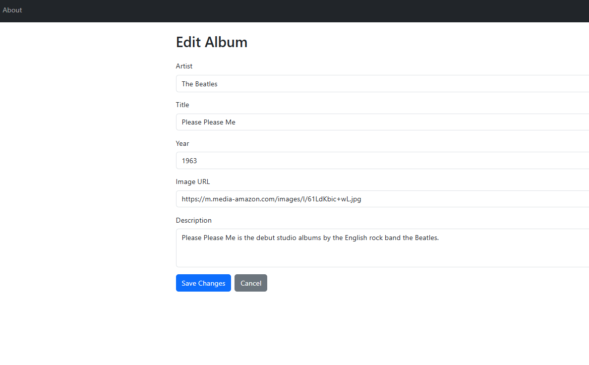
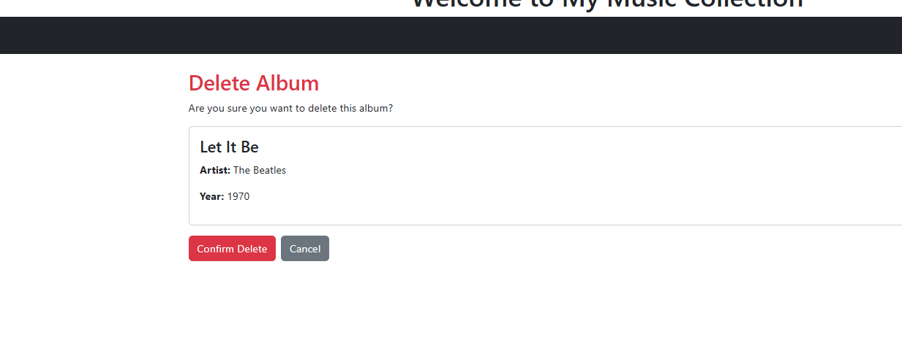

# Activity 4 

**GitHub Repository URL:** [Github](https://github.com/EENGSTROM1/cst391.git) 

**Author:** Eric Engstrom  
**Course:** CST 391  
**Date:** February 22, 2026  

---
## Introduction

This activity focused on building the Angular frontend for the Music App and integrating it with the MusicAPI backend. The primary objective was to implement routing, data binding, and service communication so that users could browse artists, view albums, display album details with tracks, and perform create, edit, and delete operations. This assignment reinforced the relationship between frontend routing and backend API endpoints, while also strengthening understanding of Angular standalone components, parameterized routes, and HttpClient integration.

The application supports a full workflow including navigating between pages, rendering API driven content, and maintaining a clean user interface using Bootstrap styling. All features were tested locally and validated using the browser console and network tab.

---

## Activity 4 Commands

```bash
npm install
npm install -g @angular/cli --latest
npm install jquery --save-dev
npm install bootstrap
npm install @popperjs/core
ng version
ng serve
```

---

## Test Links

- http://localhost:4200

---

## Screenshots and Page Explanations

### Main Application Screen



This screenshot shows the main Angular application layout. The navigation bar contains links to Create and Artist List routes, and the router outlet dynamically loads each component. This confirms the application boots correctly and routing is configured properly.

---

### Artist List Screen



The Artist List page displays all artists retrieved from the backend API. Each artist is rendered as a clickable item that routes to the Album List screen using a parameterized route. This confirms that the Angular service successfully retrieves and binds API data to the UI.

---

### Album List Screen



The Album List page displays all albums for the selected artist. The route parameter is passed to the backend, and only albums matching that artist are returned and rendered. This demonstrates proper use of route parameters and filtered API calls.

---

### Album Display Screen With Tracks



This screen displays detailed information for a single album, including title, artist, year, image, and a list of tracks. The album and its associated tracks are retrieved from the backend and rendered dynamically. This confirms nested data structures are handled correctly in Angular.

---

### Add Album Screen



The Add Album screen provides a form for creating a new album. The form captures album details and sends them to the backend using the Angular service. Upon successful submission, the user is redirected to the Artist List page. This confirms proper POST request handling and routing behavior.

---

### Edit Album Screen



The Edit Album screen loads existing album data into a form using route parameters. The user can modify the values and submit changes, which are sent to the backend via a PUT request. This confirms update functionality and data preloading.

---

### Delete Album Screen



The Delete Album screen displays a confirmation page asking the user if they are sure they want to delete the selected album. The album details are shown before deletion occurs. The user can confirm or cancel the action. This confirms proper delete workflow implementation and safe user interaction design.

---

## Troubleshooting

| Issue | Solution |
|-------|----------|
| Standalone components do not use app.module.ts | Angular 17 uses standalone components by default. RouterModule must be imported directly into each standalone component when using routerLink. |
| Route parameters not working | Ensure route paths match the exact parameter names used in ActivatedRoute. |
| 404 errors from API | Confirm backend routes match Angular service URLs and verify API is running on port 5000. |

---

## Research

### How an Angular application maintains a logged in state and communicates it to the server

Angular applications typically maintain a logged in state using authentication tokens or session identifiers returned by the backend after successful login. The frontend commonly stores this information in memory, local storage, or session storage depending on persistence requirements. A dedicated authentication service is often used to track the login state and expose it across the application.

To communicate authentication state to the server, Angular attaches credentials to outgoing HTTP requests. In cookie based authentication, the browser automatically includes session cookies with each request. In token based authentication, such as JSON Web Tokens, Angular includes the token in the Authorization header. This process is commonly automated using an HttpInterceptor, which ensures every outgoing request includes the required authentication information so the backend can validate the user.

---

## Conclusion

This activity strengthened my understanding of how Angular integrates with a RESTful backend. I implemented full routing with parameterized paths, built multiple standalone components, and connected the frontend to the MusicAPI using HttpClient. I gained experience debugging route issues, handling nested data such as album tracks, and ensuring correct alignment between frontend service calls and backend endpoints.

By completing create, edit, delete, and display functionality, I built a complete CRUD interface with clean navigation and confirmation flows. This assignment reinforced the importance of consistent model structures and careful routing configuration when developing full stack applications.