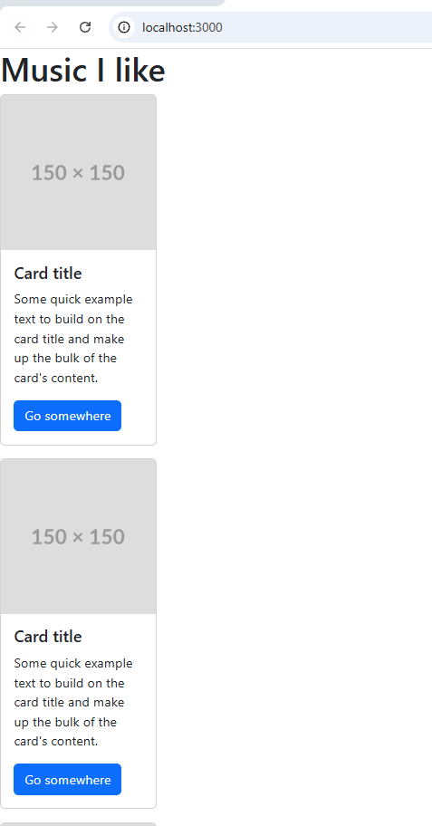
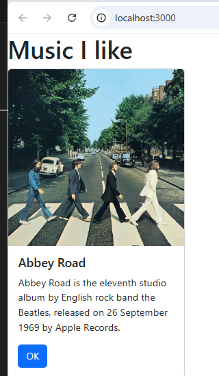
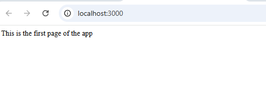
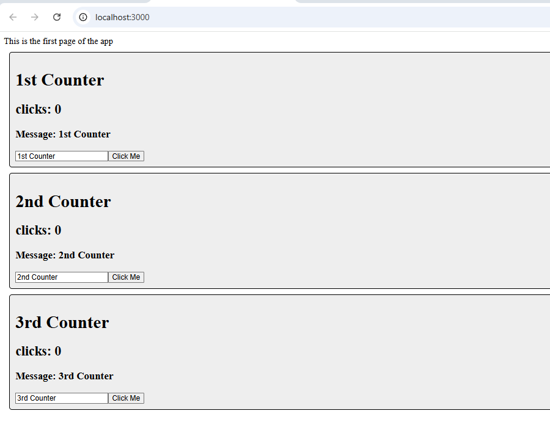
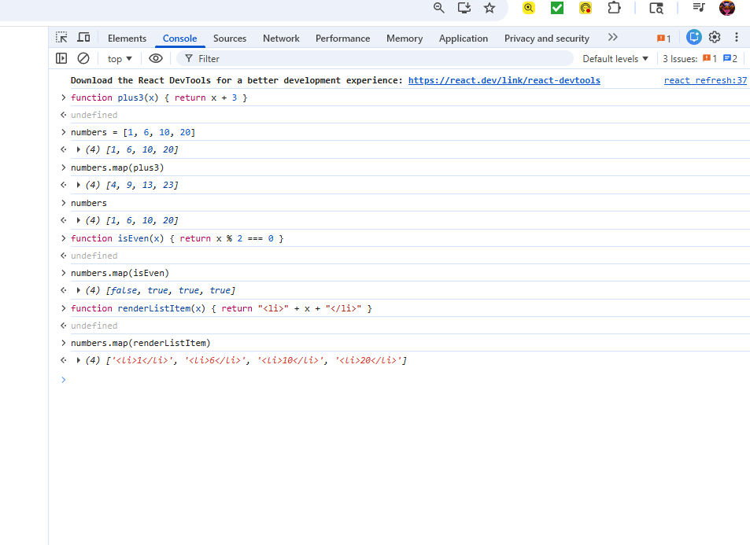
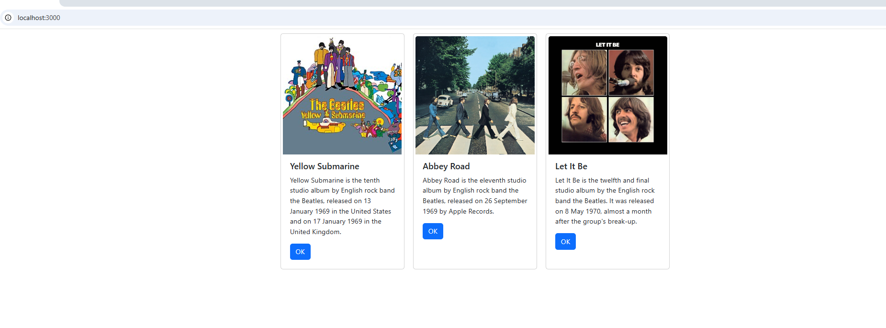

# Activity 5 

**GitHub Repository URL:** [Github](https://github.com/EENGSTROM1/cst391.git) 

**Author:** Eric Engstrom  
**Course:** CST 391  
**Date:** March 01, 2026  

---

## Activity 5 Part 1


## Screenshots


Figure 1. Initial React application after creating the project and confirming the app runs in the browser.



Figure 2. JSX content rendering after converting Bootstrap card HTML into JSX and testing the layout in the browser.



Figure 3. Final Part 1 result using reusable components and props to display album data with an album cover image.

## Code Created and Updated in Part 1

### public index html with Bootstrap CDN

~~~html
<!DOCTYPE html>
<html lang="en">
  <head>
    <meta charset="utf-8" />
    <link rel="icon" href="%PUBLIC_URL%/favicon.ico" />

    <link
      href="https://cdn.jsdelivr.net/npm/bootstrap@5.3.3/dist/css/bootstrap.min.css"
      rel="stylesheet"
    />

    <meta name="viewport" content="width=device-width, initial-scale=1" />
    <meta name="theme-color" content="#000000" />
    <meta
      name="description"
      content="Web site created using create react app"
    />
    <link rel="apple-touch-icon" href="%PUBLIC_URL%/logo192.png" />
    <link rel="manifest" href="%PUBLIC_URL%/manifest.json" />

    <title>React App</title>
  </head>
  <body>
    <noscript>You need to enable JavaScript to run this app.</noscript>
    <div id="root"></div>
  </body>
</html>
~~~


### src Card js with props and export default Card

~~~javascript
import React from 'react';

const Card = (props) => {
  return (
    <div className="card" style={{ width: '18rem' }}>
      
      <div className="card-body">
        <h5 className="card-title">{props.albumTitle}</h5>
        <p className="card-text">
          {props.albumDescription}
        </p>
        <button className="btn btn-primary">
          {props.buttonText}
        </button>
      </div>
    </div>
  );
};

export default Card;
~~~


### src App js with three Card components and album data

~~~javascript
import React from 'react';
import Card from './Card';

const App = () => {
  return (
    <div>
      <h1>Music I like</h1>

      <Card
        albumTitle="Abbey Road"
        albumDescription="Abbey Road is the eleventh studio album by English rock band the Beatles, released on 26 September 1969 by Apple Records."
        imgURL="https://upload.wikimedia.org/wikipedia/commons/a/a4/The_Beatles_Abbey_Road_album_cover.jpg"
        buttonText="OK"
      />

      <Card
        albumTitle="Let It Be"
        albumDescription="Let It Be is the twelfth and final studio album by the English rock band the Beatles. It was released on 8 May 1970."
        imgURL="https://upload.wikimedia.org/wikipedia/en/2/25/LetItBe.jpg"
        buttonText="Details"
      />

      <Card
        albumTitle="Yellow Submarine"
        albumDescription="Yellow Submarine is the tenth studio album by English rock band the Beatles, released in January 1969."
        imgURL="https://upload.wikimedia.org/wikipedia/en/a/ac/TheBeatles-YellowSubmarinealbumcover.jpg"
        buttonText="View"
      />

    </div>
  );
};

export default App;
~~~


### src index js rendering App

~~~javascript
import React from 'react';
import ReactDOM from 'react-dom/client';
import App from './App';

const root = ReactDOM.createRoot(document.getElementById('root'));
root.render(<App />);
~~~

---

## Summary

In Part 1, I created a React application and updated it to render custom JSX content instead of the default template. I integrated Bootstrap by adding the Bootstrap 5 CDN stylesheet link to the public index html file, which immediately improved the styling of the card layout and buttons. I refactored the repeated card markup into a reusable Card component and used props to pass album title, album description, image URL, and button text from the App component into each Card. New terminology introduced in this part included JSX, component, props, and CDN, and these concepts showed how React applications stay organized by splitting UI into smaller reusable parts while still supporting dynamic data.

---

## Mini App #1

This mini application demonstrates the use of state, props, hooks, and event handlers in a React functional component. The purpose of this demo was to illustrate how a component can manage its own state using the useState hook, receive values from a parent component through props, and re render automatically when state changes occur. Each Counter component maintains independent state values for click count and message input, showing how multiple instances of the same component can operate separately within the same application.

---

## Screenshots



**Figure 1. Initial rendering of the State Changer Demo application showing three Counter components with default props and initial state values. Each counter displays zero clicks and the initial message derived from props.**

---



**Figure 2. Demonstration of state updates within a Counter component. Clicking the button increments the click counter, and typing in the input field updates the message state dynamically. This confirms that state changes trigger automatic UI re rendering in React.**

---

## Summary

In this mini application, I implemented the useState hook to manage component state inside a functional component. I demonstrated how props are passed from the App component to each Counter component and how those props initialize local state values. I also implemented event handlers using onClick and onChange to update state values based on user interaction. This project reinforced the difference between props and state, showed how React re renders components automatically when state changes, and illustrated the concept of controlled components for handling form input.

## Part 2 Using State and Props in the Music Application

In this section, the Music Application was enhanced by introducing component state, dynamic rendering using the JavaScript map function, and CSS FlexBox layout styling. Instead of hardcoding multiple Card components, album data was stored inside a state variable and rendered dynamically. This prepares the application for future improvements such as loading data from external files and REST APIs.

---

## Added Application Code

### Updated App.js with State and map()

```javascript
import React, { useState } from 'react';
import Card from './Card';
import './App.css';

const App = () => {
  const [albumList, setAlbumList] = useState([
    {
      artistId: 0,
      artist: 'The Beatles',
      title: 'Yellow Submarine',
      description:
        'Yellow Submarine is the tenth studio album by English rock band the Beatles, released on 13 January 1969 in the United States and on 17 January 1969 in the United Kingdom.',
      year: 1969,
      image:
        'https://upload.wikimedia.org/wikipedia/commons/thumb/a/ac/TheBeatles-YellowSubmarinealbumcover.jpg/250px-TheBeatles-YellowSubmarinealbumcover.jpg',
    },
    {
      artistId: 1,
      artist: 'The Beatles',
      title: 'Abbey Road',
      description:
        'Abbey Road is the eleventh studio album by English rock band the Beatles, released on 26 September 1969 by Apple Records.',
      year: 1969,
      image:
        'https://upload.wikimedia.org/wikipedia/en/thumb/4/42/Beatles_-_Abbey_Road.jpg/220px-Beatles_-_Abbey_Road.jpg',
    },
    {
      artistId: 2,
      artist: 'The Beatles',
      title: 'Let It Be',
      description:
        "Let It Be is the twelfth and final studio album by the English rock band the Beatles. It was released on 8 May 1970, almost a month after the group's break-up.",
      year: 1970,
      image:
        'https://upload.wikimedia.org/wikipedia/en/thumb/2/25/LetItBe.jpg/220px-LetItBe.jpg',
    },
  ]);

  const renderedList = () => {
    return albumList.map((album) => {
      return (
        <Card
          key={album.artistId}
          albumTitle={album.title}
          albumDescription={album.description}
          buttonText="OK"
          imgURL={album.image}
        />
      );
    });
  };

  return (
    <div className="container">
      {renderedList()}
    </div>
  );
};

export default App;
```

---

### App.css Using FlexBox

```css
.container {
  display: flex;
  flex-wrap: wrap;
}

.card {
  margin: 10px;
  padding: 5px;
}
```

---

## JavaScript Console Demonstration of map()

To better understand how the map function works, the following examples were executed in the browser console.

```javascript
function plus3(x) { return x + 3 }
numbers = [1, 6, 10, 20]
numbers.map(plus3)

function isEven(x) { return x % 2 === 0 }
numbers.map(isEven)

function renderListItem(x) { return "<li>" + x + "</li>" }
numbers.map(renderListItem)
```

These examples demonstrated that the map function transforms each element of an array into a new value and returns a new array without modifying the original array. In the Music Application, map transforms album objects into JSX Card components.

---

## Screenshots



**Figure 1. JavaScript map function demonstrated in the browser console, showing transformation of array values using custom functions such as plus3, isEven, and HTML rendering.**

---



**Figure 2. Music Application rendered using FlexBox layout. The album cards are displayed horizontally and wrap dynamically based on screen size.**

---

## Summary

In this section, the Music Application was upgraded to use component state and dynamic rendering with the JavaScript map function. The album data was moved into a state variable called albumList, allowing the application to dynamically generate Card components instead of hardcoding them. The map function was used to iterate through the album array and transform each album object into a JSX component. Additionally, CSS FlexBox was implemented to improve layout and responsiveness by displaying cards horizontally with wrapping behavior. Key React terminology introduced in this section includes state, props, map function, JSX transformation, and FlexBox layout.