# Activity 6 

**GitHub Repository URL:** [Github](https://github.com/EENGSTROM1/cst391.git) 

**Author:** Eric Engstrom  
**Course:** CST 391  
**Date:** March 08, 2026  

---

## Part 3 External Data Source

## Introduction

In this section of the activity the music application was updated to retrieve album information from an external REST service instead of using a local JSON file. The React application now communicates with the Express REST API developed earlier in the course, which in turn retrieves album data stored in a MySQL database. This connection was implemented using the Axios library, which simplifies making HTTP requests from the browser. Additionally, asynchronous programming using async and await was introduced so the application can request data from the server without freezing the user interface. This allows the frontend React application to dynamically load album information while keeping the interface responsive.

---

## Activity 6 Commands

```
cd activities/activity6/music
npm install axios
npm start
```

---

## Test Links

- http://localhost:3000  
- http://localhost:3001  

---

## Screenshot – Axios Configuration

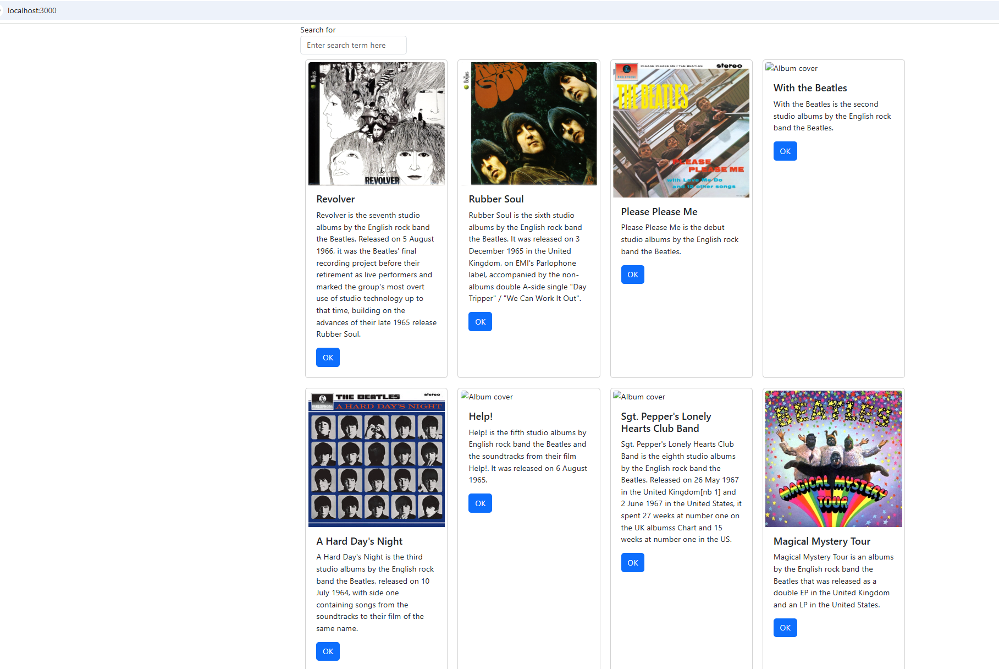

This screenshot shows the Axios configuration used to connect the React application to the external REST service. The Axios library was installed and a new file named **dataSource.js** was created. This file defines the base URL for the Express server so the React application can make HTTP requests to retrieve album data.

---

## Screenshot – Search Bar Interface

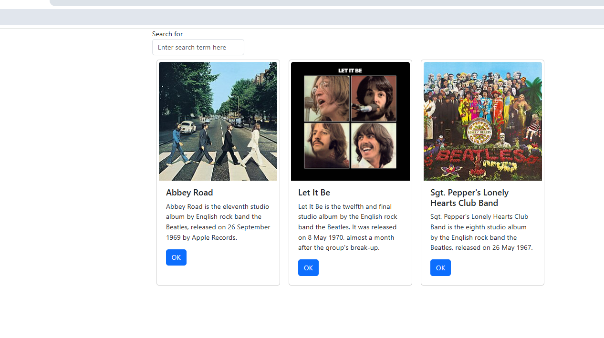

This screenshot displays the search bar that allows the user to type a keyword to filter albums. The search input uses React state to capture the user’s input in real time. As the user types characters into the search field, the application stores the search phrase and prepares it to be used for filtering the displayed album list.

---

## Screenshot – Search Component Placement

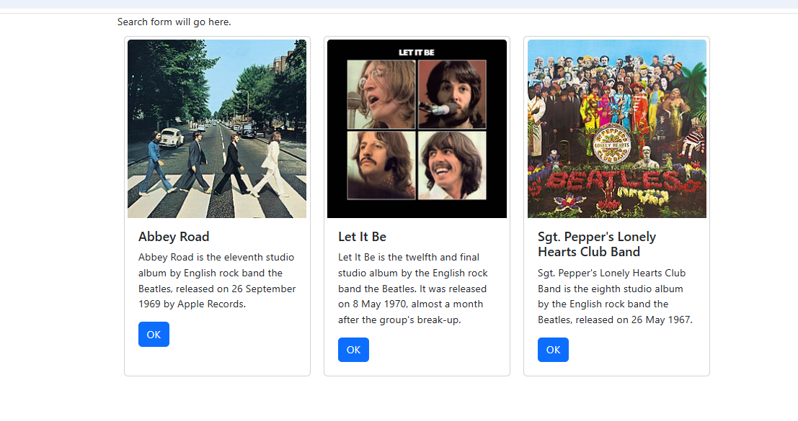

This screenshot shows where the search component is placed within the application layout. The `SearchForm` component is rendered inside the main application container and communicates with the parent `App` component using callback functions. This allows the search phrase entered by the user to be passed upward through the component hierarchy.

---

## Screenshot – Search Handler Debug Output

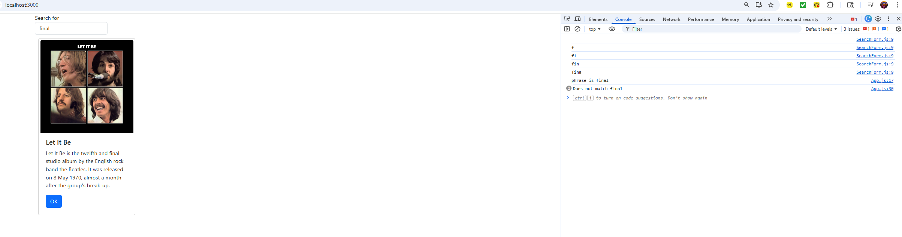

This screenshot demonstrates the search handler functionality within the browser console. As the user types into the search box, the application logs each character entered and displays debugging messages. These messages confirm that the search phrase is successfully passed from the `SearchForm` component to the parent `App` component.

---

## Screenshot – Final Search Results

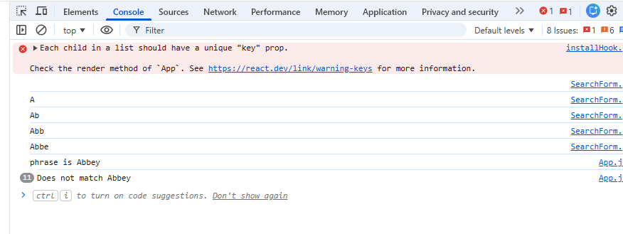

This screenshot shows the completed search functionality in the music application. Album data is retrieved from the REST API and then filtered locally in the React application based on the search phrase entered by the user. Only albums whose descriptions contain the search term remain visible on the screen.

---

## Summary of New Features

Several new features were introduced in this section of the activity. The React application now retrieves album data from an external REST service instead of using static JSON data stored locally. The Axios library was installed and configured to handle HTTP requests between the frontend and backend servers. Additionally, asynchronous programming concepts such as async and await were implemented to allow the application to fetch data from the server without blocking the user interface. Important terminology introduced in this section includes REST services, Axios, asynchronous programming, promises, and async/await. These technologies are commonly used in modern full stack web development to allow frontend applications to dynamically interact with backend services.

---

## Conclusion

This portion of the activity demonstrated how a React application can communicate with an external REST service to retrieve data dynamically. By integrating Axios and using asynchronous programming techniques, the music application can request album data from the backend server while maintaining a responsive user interface. The separation of the React frontend and the Express backend illustrates how modern web applications are designed using layered architecture. This approach improves scalability, maintainability, and performance when building real world applications.

---

## Troubleshooting

| Issue | Solution |
|------|---------|
| Axios request returned a 404 error | Confirm the Express REST API server is running and that the correct port number is configured in `dataSource.js`. |
| Albums did not load in the React application | Verify the `/albums` endpoint is accessible in the browser and returning JSON data. |
| Some album covers did not appear | Some database entries may contain image links that are not available in the React project. |
| React console warning about unique keys | This warning appears when React expects a unique key value for list elements. The application still functions normally. |

---

## Mini App #2 - Routing Application Demo

In this mini application we demonstrated how routing works in a React application using the React Router library. Routing allows a web application to display different content depending on the URL in the browser without requiring a full page refresh. Instead of loading separate HTML pages, React dynamically renders different components based on the route path. In this application we created several routes including About, Contact Us, Login, and a dynamic User route. The project also demonstrates protected routes using a PrivateRoute component that prevents users from accessing certain pages unless they are authenticated.

---

### Initial Application Page

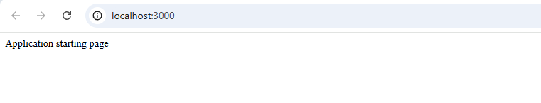

The initial application page displays the navigation bar and the login page. The navigation links are created using React Router's Link component which allows users to move between routes without reloading the browser. The login page contains a button that simulates user authentication. This page demonstrates how routing directs users to different components based on the URL path.

---

### Navigation Bar

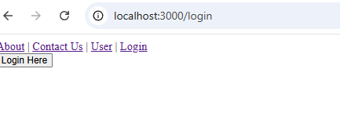

The navigation bar provides links to the various routes in the application including the About page, Contact page, User route, and Login page. Instead of traditional anchor tags, React Router uses Link components which update the URL and render the correct component without refreshing the entire application. This improves the performance and user experience of the application.

---

### About Page

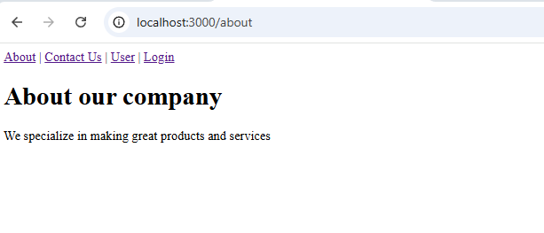

The About page is a protected route that displays information about the company. This component demonstrates how a route can be wrapped inside a PrivateRoute component to ensure that only authenticated users can access it. If a user attempts to visit this route without logging in, they will be redirected to the login page.

---

## Contact Us Page

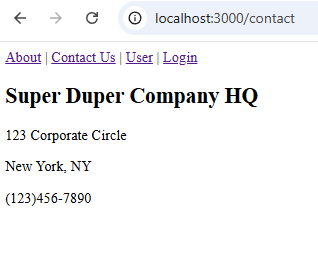

The Contact Us page is another protected route that displays company contact information. Similar to the About page, access to this page requires the user to be logged in. The PrivateRoute component checks the login state before rendering the ContactUs component and redirects the user if they are not authorized.

---

## User Route (Dynamic Routing)

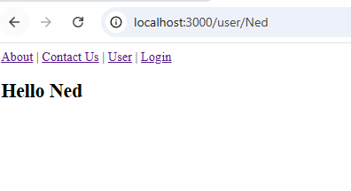

The User route demonstrates dynamic routing using URL parameters. The route is defined using `/user/:username`, allowing different usernames to appear in the URL. The User component retrieves this parameter using the useParams hook and displays a personalized greeting based on the value in the route.

---

## Summary of Features and Terminology

This application introduced several important routing concepts in React. The BrowserRouter component acts as the top level router that manages navigation and synchronizes the UI with the browser URL. Routes and Route components define which component should render for each URL path. The Link component allows navigation between routes without refreshing the page, making the application behave more like a single page application. Dynamic routing was demonstrated using URL parameters which allow values in the path to be accessed within a component using the useParams hook. Additionally, the application introduced protected routes using a custom PrivateRoute component that restricts access to certain pages unless the user is authenticated. Together these features demonstrate how React Router can control navigation, protect routes, and dynamically render content based on the current URL.

---

## Part 4 - Navigation Routing

This section demonstrates the implementation of navigation routing within the Music Application. React Router was introduced to allow the application to behave more like a multi page application while still operating within a single page environment. Using React Router components such as BrowserRouter, Routes, and Route, the application can render different components depending on the URL path. The NavBar component provides navigation links that allow users to move between the main search page and the new album page. In addition, dynamic routing is implemented using the path `/show/:albumId`, which allows the application to display detailed information for a selected album. When the user clicks the **OK** button on an album card, the application programmatically navigates to the album details page using the `useNavigate` hook. This demonstrates how React Router manages application state and navigation without requiring a full page reload.

---

## Main Application Page

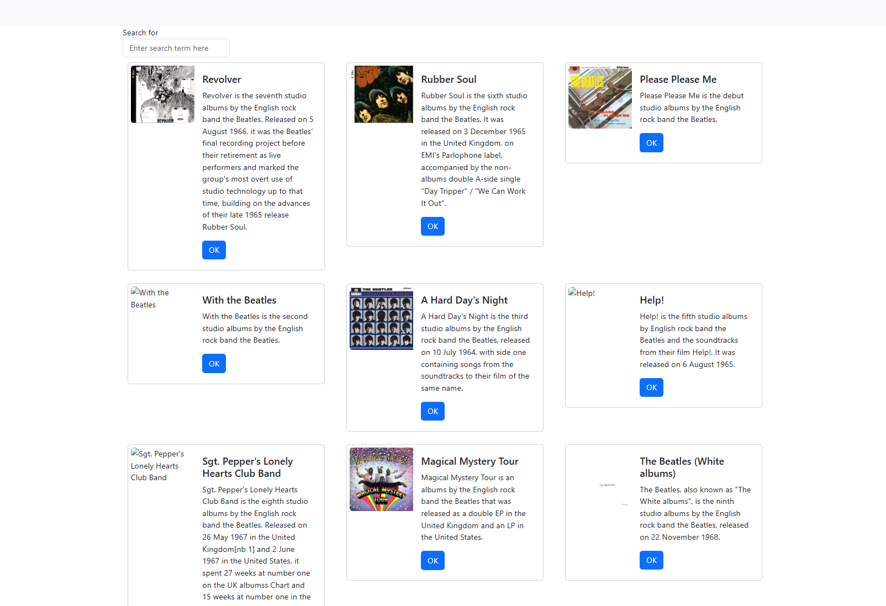

This screenshot shows the main page of the Music Application. The search form is displayed at the top, allowing users to filter albums based on the description. Below the search form, the album list is rendered using the Card component. Each album is displayed in a horizontal card layout containing the album image, title, description, and an **OK** button used to navigate to the album details page.

---

## Navigation Bar

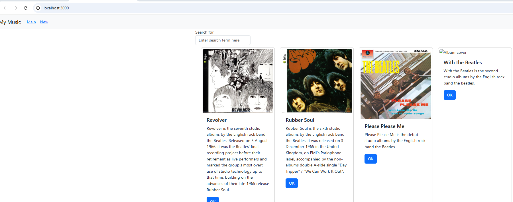

This screenshot shows the NavBar component used for application navigation. The navigation bar contains links to the **Main** page and the **New** album page. These links use the React Router `Link` component, which allows users to navigate between routes without refreshing the page. This demonstrates how React Router enables client side navigation within the application.

---

## Album Details Page

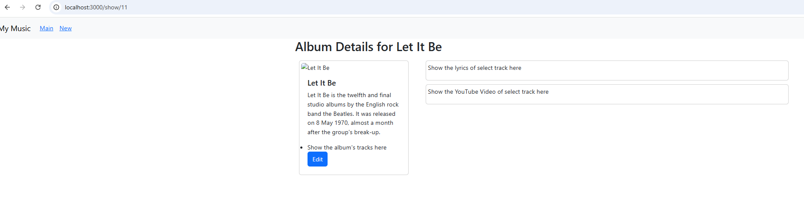

This screenshot displays the album details page rendered by the OneAlbum component. When the **OK** button is clicked on an album card, the application navigates to a dynamic route using the pattern `/show/:albumId`. The selected album's information is then displayed, including the album title, description, and image. Additional placeholders are provided for track listings, lyrics, and a YouTube video for future development.

---

## New Album Page

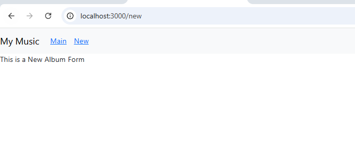

This screenshot shows the New Album page that is displayed when the user navigates to the `/new` route. The NewAlbum component currently acts as a placeholder for a future album creation form. This stub component confirms that routing between pages works correctly within the application.

---

## Summary of New Features

In this part of the activity, navigation routing was added to the Music Application using React Router. Several new concepts were introduced including BrowserRouter, Routes, Route, and Link. BrowserRouter acts as the wrapper that enables routing within the application, while Routes and Route define which components should render for specific URL paths. Dynamic routing was implemented using the path `/show/:albumId`, allowing the application to display detailed album information based on the selected album. The `useNavigate` hook allows components to programmatically change routes when a user interacts with the interface. These features allow the application to behave like a multi page application while still maintaining the performance advantages of a single page React application.