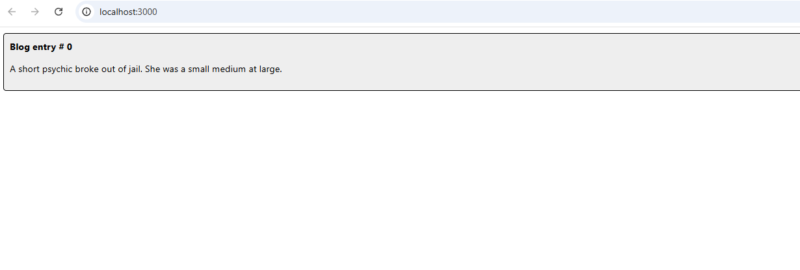
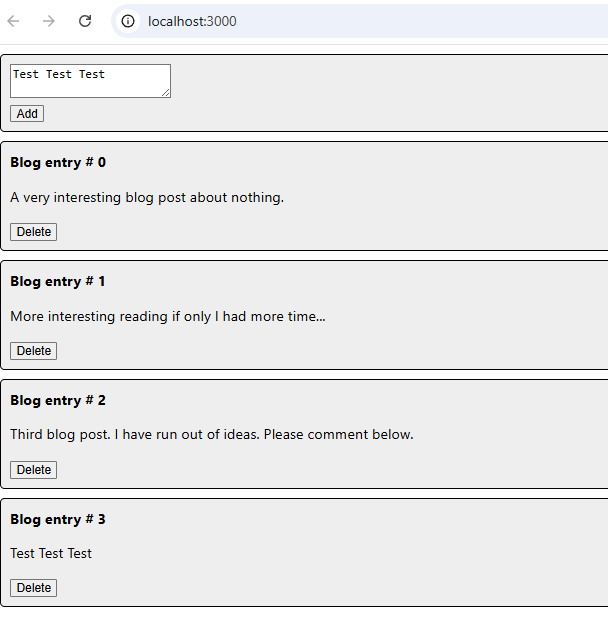
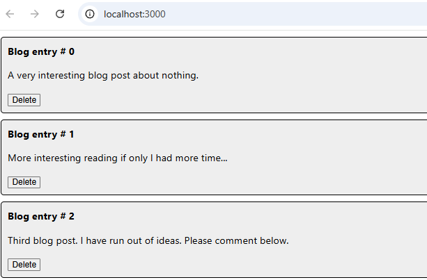
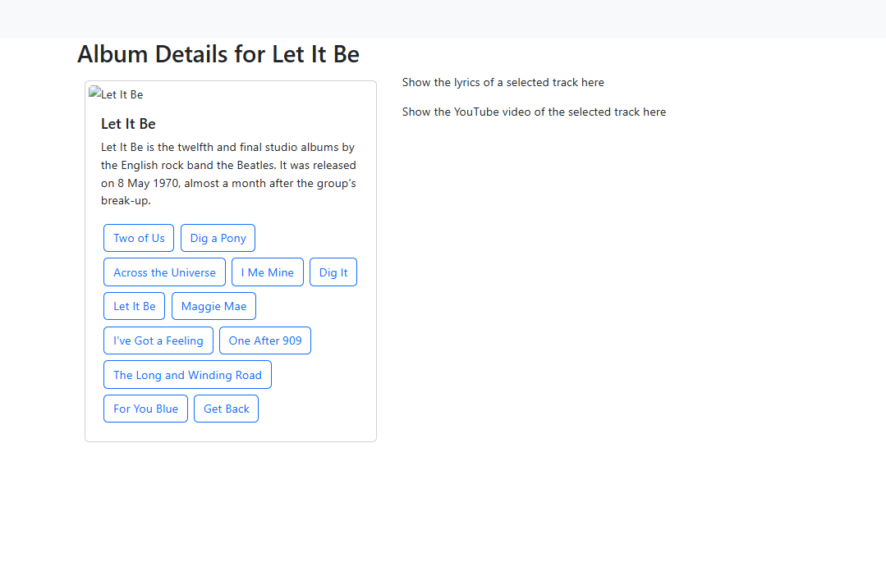
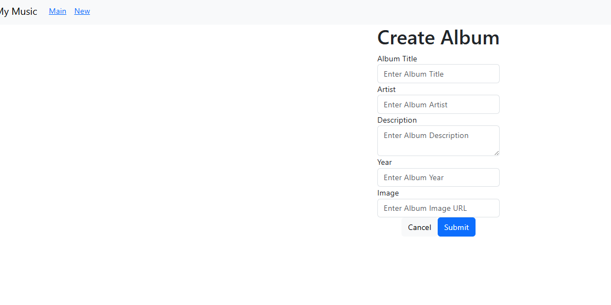
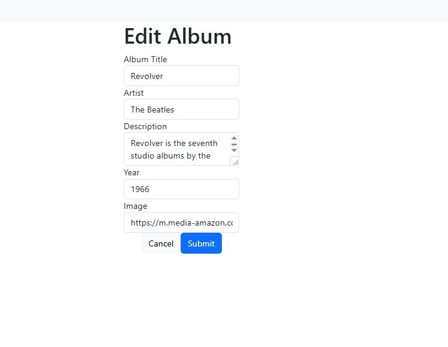

# Activity 7 

**GitHub Repository URL:** [Github](https://github.com/EENGSTROM1/cst391.git) 

**Author:** Eric Engstrom  
**Course:** CST 391  
**Date:** March 15, 2026  

---

## Mini App #3 – Dynamic Components Demo

This section of Activity 7 introduces dynamic component rendering in React through the creation of a small blog application. The purpose of this mini application is to demonstrate how React components can be dynamically generated, added, and removed based on application state. These techniques are foundational for modern React applications and will later be applied to the music application used throughout the course.

The application allows users to create blog posts through a simple text entry form. Each post is rendered as a reusable component and displayed in a list on the page. Every blog entry includes a delete button that allows the user to remove posts dynamically. When posts are added or removed, React automatically re renders the interface based on the updated state.

The application uses several important React concepts. The `useState` hook manages the collection of blog posts stored in application state. The `map()` function dynamically renders a list of `Post` components from the stored array of blog entries. Each component receives data through `props`, which allows the parent component to pass information and callback functions to child components. Additionally, the data entry form is implemented as a **controlled component**, meaning the text input value is managed by React state and updated during each change event.

These techniques demonstrate how React manages UI updates efficiently through state driven rendering and reusable components.

---

### React Application Initialization

The first step in this mini application was creating a new React project using the Create React App tool. The project structure was initialized, unnecessary default files were removed, and the application was configured to render custom components.

**Caption:**  
This screenshot shows the initial React application after configuration. The default template files were removed and the project was prepared to display the custom blog components created for this exercise.

---

### Dynamic Blog Post Creation

A new component named `AddPost` was created to allow users to submit blog entries through a text area input. This component demonstrates the concept of a controlled component in React. The input field updates its value through the `onChange` event, and the text is stored in the component's state using the `useState` hook. When the Add button is clicked, the entered text is passed back to the parent `App` component through a callback function. The parent component then appends the new blog entry to the existing list using React's spread syntax.

**Caption:**  
This screenshot shows the blog post entry form where users can type and submit new blog posts. The form is implemented as a controlled component that updates its state on every keystroke and sends the entered text back to the parent component when the Add button is clicked.

---

### Dynamic Blog Entry List

After adding several blog posts, the application dynamically renders each post as an individual component. The `map()` function iterates over the list of blog posts stored in state and generates a `Post` component for each entry. Each component receives its text content and identifier through props, allowing React to efficiently track and update the list of rendered components.

**Caption:**  
This screenshot displays multiple blog entries rendered dynamically in the application. Each blog post is generated using the `map()` function and displayed through a reusable `Post` component. Each entry also contains a delete button that allows users to remove posts from the list.

---

### Summary of New Concepts

This mini application introduced several key React concepts that enable dynamic user interfaces. The `useState` hook was used to manage application data, allowing the blog post list to update automatically whenever new posts are added or existing posts are deleted. The `map()` function allowed the application to dynamically render a list of components from an array of data. The `props` object was used to pass information and callback functions between parent and child components. Additionally, the blog entry form demonstrated the use of controlled components, where the input value is maintained within React state and updated through event handlers. Together, these techniques illustrate how React efficiently updates the user interface in response to changes in application state.

---

## Part 5 - Dynamic Components Demo

This screenshot demonstrates the dynamic album details page of the Music application. When a user selects an album from the main list, the application dynamically loads the album’s information including the cover image, title, description, and track list. Each track is rendered as an interactive button generated from the album’s track data rather than being hard coded in the interface. This behavior is achieved using React dynamic components that render content based on the application’s current state. When a track button is selected, the application updates the interface to display the lyrics and the corresponding YouTube video in the panels on the right side of the page. This demonstrates how React components can dynamically update portions of the user interface without reloading the page. Key terminology introduced in this lesson includes **dynamic components**, which are React components that render content based on data or state changes, **props**, which allow data to be passed between components, and **state**, which tracks information within a component and triggers updates when the data changes.

---

## Summary of New Features
Dynamic components were introduced in this lesson to allow the Music application to display album and track information based on data rather than hard coded values. Instead of manually creating interface elements, React components now render album details, track buttons, lyrics, and video sections dynamically using the album data returned from the API. When a user selects an album from the main page, the application loads the correct album information and displays its tracks automatically. Each track button is generated from the album’s track list and updates the lyrics and video panels when clicked, demonstrating how components can react to user interaction without refreshing the page. Key terminology introduced includes dynamic components, which render content based on data or application state, props, which are used to pass data between React components, and state, which stores information inside a component and allows the interface to update whenever that data changes.

---

## Part 6 - New Album

The New Album page allows users to create and submit a new album through a controlled data entry form. Each input field in the form is connected to React state using the `useState` hook. As a user types into a field, the `onChange` event updates the corresponding state value, ensuring the form always reflects the current data. When the user submits the form, the `onSubmit` event prevents the default page refresh and constructs an album object containing the form values. This album object is then sent to the backend API using an asynchronous POST request through the `dataSource` service. After the album is successfully created, the application navigates back to the main page and refreshes the album list so the newly created album appears immediately.

### Summary of New Features

This part of the activity introduced controlled components for managing form data within a React application. Controlled components are form elements whose values are managed by React state instead of the browser’s internal form state. The `useState` hook was used to store values for album title, artist, description, year, and image URL. Event handlers such as `onChange` update the state whenever the user modifies an input field, ensuring React always controls the form data. The lesson also introduced handling form submissions using the `onSubmit` event and preventing the default browser behavior using `event.preventDefault()`. Additionally, an asynchronous API request was implemented using `axios` through the `dataSource` service to send the new album data to the backend server. Once the album is created, the application automatically refreshes the album list and navigates back to the main page, demonstrating how frontend components interact with backend services in a full stack application.

---

## Part 7 - Edit an Album

**Caption:**  
The Edit Album page allows a user to modify the information of an existing album. When the Edit button is selected from the Album Details page, the application navigates to the Edit Album form and automatically populates the input fields with the album’s current data. The user can change the album title, artist, description, year, or image URL and then submit the form to update the record. This demonstrates how React components can reuse a form for both creating and editing records while maintaining application state and navigation.

### Summary

This part of the activity introduced the ability to edit an existing album using a reusable React component. The `EditAlbum` component dynamically loads album data into a controlled form so the user can modify the album’s information. React Router is used to navigate between pages and pass the selected album to the edit form through route parameters. When the user submits the form, the application updates the album and reloads the album list to reflect the changes. A key concept introduced in this lesson is a **controlled component**, which is a form element whose value is managed by React state instead of the browser. Another important concept is **dynamic routing**, where parameters in the URL are used to load specific data such as the album being edited. These techniques help create interactive user interfaces and allow applications to manage and update data efficiently.