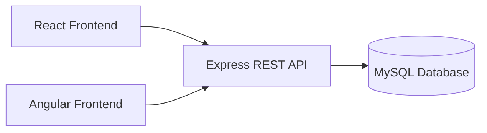
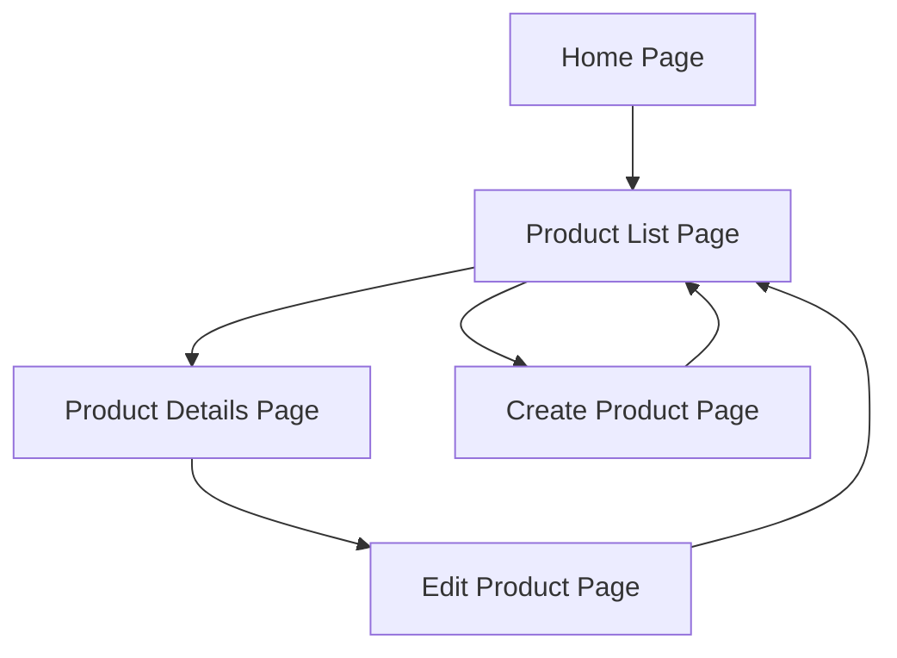

# Milestone 1

**GitHub Repository URL:** https://github.com/EENGSTROM1/cst391.git  

**Author:** Eric Engstrom  
**Course:** CST 391  
**Assignment:** Milestone 1  
**Date:** February 1, 2026  

---

## Introduction

This milestone introduces the design and planning phase for a full stack web application that will be developed over multiple milestones. The purpose of this assignment is to define the scope, functionality, and technical direction of the project before implementation begins. The application will be built using a JavaScript based technology stack consisting of an Express backend connected to a MySQL database, along with two separate frontend implementations using Angular and React.

The application will manage a single core product entity and support full create, read, update, and delete operations. While the technical stack mirrors previous activity assignments, this project differs by requiring all architectural decisions, data models, and user interface designs to be created independently. This milestone focuses on clearly documenting those design decisions so development can proceed in a structured and organized manner throughout the remaining milestones.

---

## Requirements

The application must support the following functional and technical requirements.

1. The system must manage a product entity stored in a MySQL database.
2. Each product must contain multiple properties using at least three different data types.
3. The system must allow users to create new products.
4. The system must allow users to view a list of all products.
5. The system must allow users to view details for a single product.
6. The system must allow users to update an existing product.
7. The system must allow users to delete a product.
8. The backend must be implemented using NodeJS and Express.
9. The backend must expose REST style endpoints to support all product operations.
10. The frontend must be implemented twice using Angular and React while sharing the same backend services.
11. The application design must be documented using diagrams and written explanations.

---

## Application Architecture

The following diagram illustrates the high level architecture of the application.



---

## Sitemap
Below is the logical sitemap for the application showing the major pages and navigation flow.



---

## Wireframes
These wireframes represent a structured visual layout of the application pages, illustrating the primary interface components, data fields, and user actions for each view. The diagrams show how users navigate between pages and interact with core elements such as tables, forms, and action buttons. While the designs are not styled or finalized, they clearly define page structure and functional intent. These wireframes will serve as a reference for implementing consistent user interfaces in both the Angular and React frontend applications.

```mermaid
flowchart TB

    %% Home Page
    subgraph HomePage["Home Page"]
        H1["Header<br/>Application Title"]
        H2["Description<br/>Brief explanation of app purpose"]
        H3(["Primary Action Button<br/>View Products"])
    end

    %% Product List Page
    subgraph ProductList["Product List Page"]
        L1["Header<br/>Products"]
        L2(["Create Product Button"])
        L3["Table<br/>ID, Name, Price, Quantity"]
        L4["Actions<br/>View, Edit, Delete"]
    end

    %% Product Details Page
    subgraph ProductDetails["Product Details Page"]
        D1["Header<br/>Product Details"]
        D2["Field<br/>Name"]
        D3["Field<br/>Description"]
        D4["Field<br/>Price"]
        D5["Field<br/>Quantity"]
        D6(["Button<br/>Edit Product"])
        D7(["Button<br/>Back to List"])
    end

    %% Create/Edit Product Page
    subgraph ProductForm["Create / Edit Product Page"]
        F1["Header<br/>Create or Edit Product"]
        F2["Input<br/>Name"]
        F3["Textarea<br/>Description"]
        F4["Input<br/>Price"]
        F5["Input<br/>Quantity"]
        F6(["Button<br/>Save"])
        F7(["Button<br/>Cancel"])
    end

    %% Navigation Flow
    HomePage --> ProductList
    ProductList --> ProductDetails
    ProductList --> ProductForm
    ProductDetails --> ProductForm
    ProductForm --> ProductList
 ```

---

### Initial Database Design (EER)
The application uses a single Product entity that supports multiple data types to meet project requirements.

```mermaid
erDiagram
    PRODUCT {
        int id PK
        string name
        string description
        decimal price
        int quantity
        datetime createdAt
    }

 ```

 ---

## UML Class Diagrams
The following UML diagram represents the initial backend class structure.

```mermaid
classDiagram
    class Product {
        int id
        String name
        String description
        decimal price
        int quantity
    }

    class ProductController {
        getAllProducts()
        getProductById(id)
        createProduct(product)
        updateProduct(id, product)
        deleteProduct(id)
    }

    class ProductService {
        findAll()
        findById(id)
        save(product)
        update(id, product)
        delete(id)
    }

    class ProductDAO {
        findAll()
        findById(id)
        insert(product)
        update(id, product)
        delete(id)
    }

    ProductController --> ProductService
    ProductService --> ProductDAO
    ProductDAO --> Product
 ```

---

## Risk

1. Differences between Angular and React state management may introduce inconsistencies.

2. API contract changes could impact both frontend implementations simultaneously.

3. Database configuration issues may occur across different development environments.

4. Time management across multiple milestones may limit feature expansion.

---

## Conclusion
This milestone provided the foundation for the entire project by defining the application scope, functionality, and technical approach before development begins. By planning the database structure, application flow, and user interface early, the project reduces the risk of major design changes later in the development cycle. This assignment reinforced the importance of documentation and design driven development when building scalable web applications.

Completing this milestone also helped clarify how a single backend service can support multiple frontend frameworks while maintaining consistent behavior and data integrity. The planning completed here will directly support efficient implementation and testing in future milestones while ensuring all requirements are clearly understood and traceable throughout the project lifecycle.