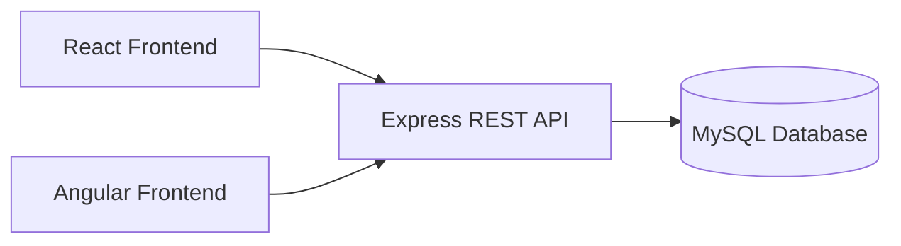
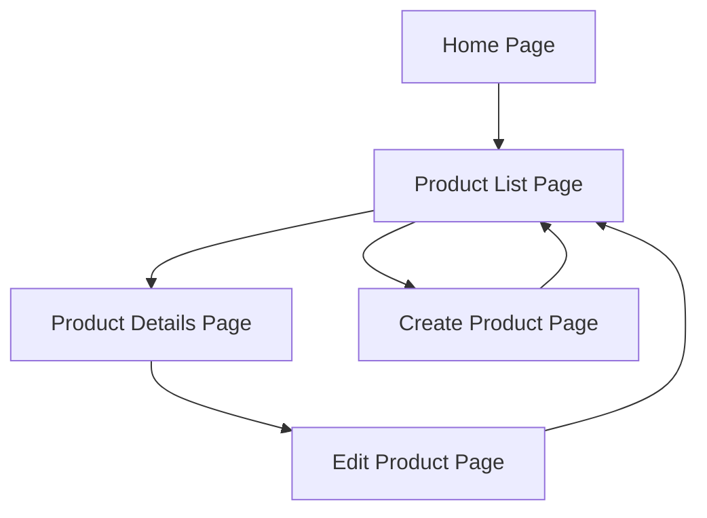
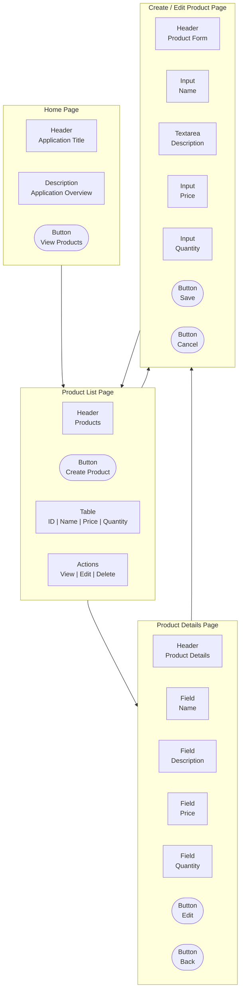
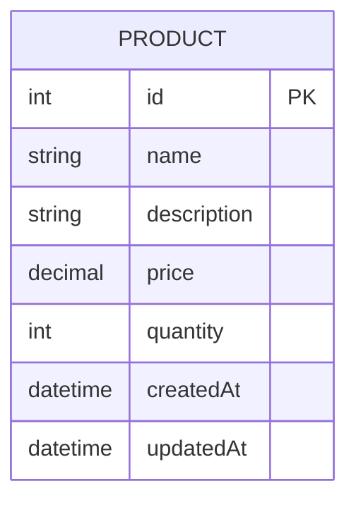
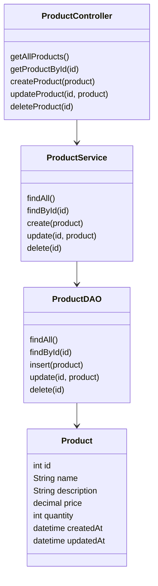

# Milestone 2

**GitHub Repository URL:** https://github.com/EENGSTROM1/cst391.git  

**Author:** Eric Engstrom  
**Course:** CST 391  
**Assignment:** Milestone 2  
**Date:** February 8, 2026  

---

## Instructor Feedback

### Instructor Feedback Provided
No instructor feedback was provided for Milestone 1.

### Response to Instructor Feedback
Because no feedback was received, this milestone focuses on refining and expanding the original proposal by improving clarity, strengthening technical detail, and formally introducing the REST API design that will be implemented in later milestones. All original design decisions remain intact, with additional detail added to better support implementation.

---

## Introduction

This milestone builds upon the initial planning and design work completed in Milestone 1. The project consists of a full stack web application implemented using a shared backend REST API and two separate frontend applications built with Angular and React. Both frontend applications will provide identical functionality while consuming the same backend services.

The application manages a single core product entity and supports full create, read, update, and delete operations. The backend will be developed using NodeJS and Express, with persistent storage provided by a MySQL database. This milestone refines the original proposal by expanding architectural documentation, clarifying requirements, and defining RESTful endpoints that follow standard conventions.

---

## Requirements

The application must support the following functional and technical requirements.

1. The system must manage a product entity stored in a MySQL database.
2. Each product must contain multiple properties using at least three different data types.
3. The system must allow users to create new products.
4. The system must allow users to retrieve a list of all products.
5. The system must allow users to retrieve details for a single product.
6. The system must allow users to update an existing product.
7. The system must allow users to delete a product.
8. The backend must be implemented using NodeJS and Express.
9. The backend must expose REST compliant endpoints for all product operations.
10. Two frontend applications must be implemented using Angular and React while sharing the same backend API.
11. The application design must be documented using diagrams and written explanations.

---

## Application Architecture

The following diagram illustrates the high level architecture of the application.



---

## Sitemap
The following sitemap represents the logical navigation structure of the application.



---

## Wireframes
These wireframes represent a structured visual layout of the application pages, illustrating the primary interface components, data fields, and user actions for each view. The diagrams show how users navigate between pages and interact with core elements such as tables, forms, and action buttons. While the designs are not styled or finalized, they clearly define page structure and functional intent. These wireframes will serve as a reference for implementing consistent user interfaces in both the Angular and React frontend applications.




---

### Database Design
The application uses a single Product entity to support all required operations.



---

## UML Class Diagrams
The following UML diagram represents the planned backend class structure.



---

## REST Endpoints

The REST API follows standard REST conventions using plural resource names and HTTP verbs to define actions.

| Method | Endpoint            | Description                          |
|-------|---------------------|--------------------------------------|
| GET   | /api/products       | Retrieve a list of all products      |
| GET   | /api/products/:id   | Retrieve a single product by ID      |
| POST  | /api/products       | Create a new product                 |
| PUT   | /api/products/:id   | Update an existing product           |
| DELETE| /api/products/:id   | Delete a product                     |

---

## API Example Requests

```json
GET /api/products
Response:
[
  {
    "id": 1,
    "name": "Gaming Mouse",
    "description": "Wireless ergonomic gaming mouse",
    "price": 59.99,
    "quantity": 25,
    "createdAt": "2026-02-01T14:22:00"
  },
  {
    "id": 2,
    "name": "Mechanical Keyboard",
    "description": "RGB mechanical keyboard",
    "price": 129.99,
    "quantity": 12,
    "createdAt": "2026-02-01T14:25:00"
  }
]
```

```json
GET /api/products/1
Response:
{
  "id": 1,
  "name": "Gaming Mouse",
  "description": "Wireless ergonomic gaming mouse",
  "price": 59.99,
  "quantity": 25,
  "createdAt": "2026-02-01T14:22:00"
}
```

---

## Risk

1. Differences between Angular and React state management may introduce inconsistencies.

2. Changes to API contracts impact both frontend implementations simultaneously.

3. Database configuration differences across environments may slow development.

4. Milestone deadlines may limit feature expansion.

---

## Conclusion
This milestone refined the original project proposal by expanding technical documentation and formally defining the REST API design. Clearly documenting endpoints, data models, and architecture strengthens the foundation for implementation in future milestones. This work reinforced the importance of design driven development and traceability when building scalable, maintainable web applications.
