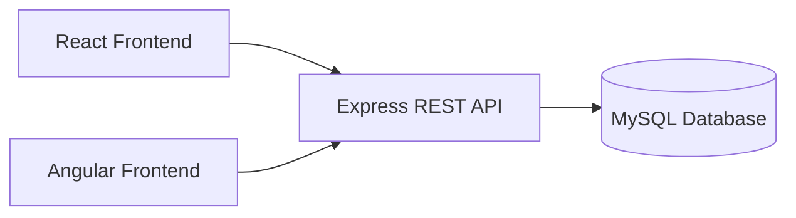
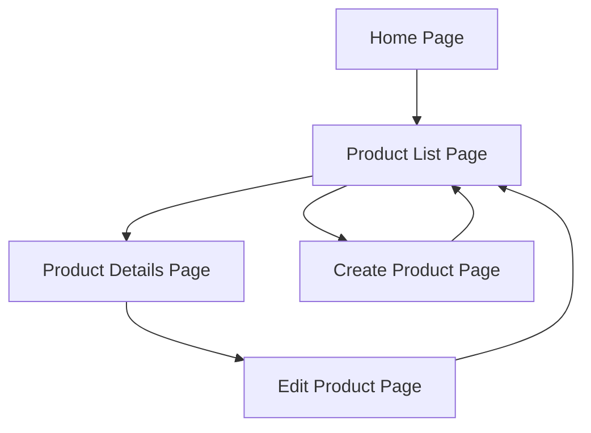
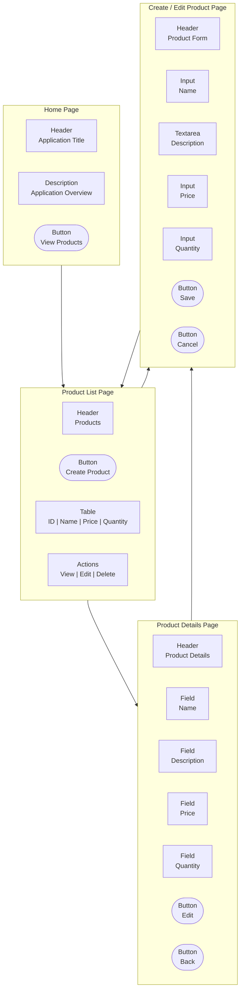
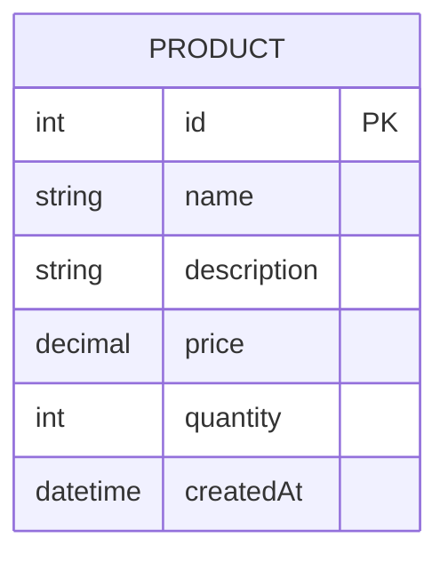
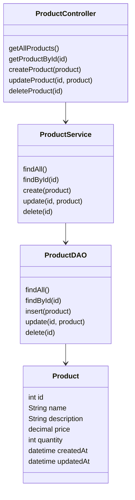

# Milestone 3 - Benchmark

**GitHub Repository URL:** https://github.com/EENGSTROM1/cst391.git  

**Author:** Eric Engstrom  
**Course:** CST 391  
**Assignment:** Milestone 3  
**Date:** February 8, 2026  

---

## Project Presentation

The following PowerPoint summarizes the REST API implementation, challenges encountered, pending issues, and lessons learned for Milestone 3.

- [Milestone 3 REST API Presentation](CST391_Milestone3_REST_API_Presentation.pptx)

- [Download Milestone 3 PowerPoint](./CST391_Milestone3_REST_API_Presentation.pptx)

---

## Recording

The following recording demonstrates the functionality of the Milestone 3 REST API implementation. The screencast provides a walkthrough of each CRUD operation using Postman and verifies database changes using MySQL queries.

The recording includes:
- Execution of all REST API endpoints in Postman
- Create, read, update, and delete operations on Product data
- Verification of database changes using MySQL Workbench

### Milestone 3 Screencast
[Link to Milestone 3 REST API Screencast – [Rest API Video](https://www.loom.com/share/4faab88d54eb478ea7cd5c92c17b535f)]

---

## Introduction

This milestone builds upon the approved design and planning completed in the previous milestones by transitioning the project into full backend implementation. The focus of this milestone is the development of a functional RESTful API using NodeJS, Express, and TypeScript, with data persistence provided by a MySQL relational database. The implemented API serves as the foundation for future frontend integration using Angular and React.

The application manages a single core Product entity and fully supports create, read, update, and delete operations. All REST endpoints were implemented according to standard REST conventions and tested using Postman to validate functionality and database interaction. This milestone demonstrates the successful alignment of design documentation with working software and establishes a stable backend architecture that will support continued development and testing in subsequent milestones.

---

## Requirements

The application must support the following functional and technical requirements.

1. The system must manage a Product entity stored in a MySQL relational database.
2. Each Product must contain multiple properties using at least three different data types.
3. The system must provide create, read, update, and delete operations for Product data.
4. The backend must be implemented using NodeJS and the Express framework.
5. The backend must be written in TypeScript.
6. The backend must expose REST compliant endpoints that follow standard REST conventions.
7. The REST API must return and accept data in JSON format.
8. The REST API must support anonymous access, with no authentication or authorization required.
9. All REST endpoints must be tested using Postman.
10. Database changes resulting from create, update, and delete operations must be verifiable through MySQL queries.
11. The backend application must use a layered architecture separating routes, controllers, services, and data access logic.
12. Two frontend applications using Angular and React will consume the same backend API in future milestones.
13. The application design and implementation must be documented using diagrams and written explanations.

---

## Backend Code Structure

The backend application is organized using a layered architecture to separate concerns and improve maintainability. Each layer has a clearly defined responsibility, allowing the REST API to be easily extended and tested.

```text
milestone3/
├── src/
│   ├── app.ts
│   ├── controllers/
│   │   └── ProductController.ts
│   ├── services/
│   │   └── ProductService.ts
│   ├── dao/
│   │   └── ProductDAO.ts
│   ├── models/
│   │   └── Product.ts
│   ├── routes/
│   │   └── productRoutes.ts
│   └── db/
│       └── database.ts
├── .env
├── package.json
├── tsconfig.json
└── README.md
```

---

## Application Architecture

The following diagram illustrates the high level architecture of the application.



---

## Sitemap
The following sitemap represents the logical navigation structure of the application.



---

## Wireframes
These wireframes represent a structured visual layout of the application pages, illustrating the primary interface components, data fields, and user actions for each view. The diagrams show how users navigate between pages and interact with core elements such as tables, forms, and action buttons. While the designs are not styled or finalized, they clearly define page structure and functional intent. These wireframes will serve as a reference for implementing consistent user interfaces in both the Angular and React frontend applications.




---

## Design Updates

The overall system design remains consistent with the proposal defined in Milestone 2. The primary update for this milestone is the implementation of the backend REST API using Express and TypeScript. The Product entity, database schema, and layered architecture were implemented as designed. Minor implementation level details, such as the use of a connection pool for MySQL and basic error handling in controllers, were added to support stable operation of the API.

---

## Design Updates Summary

| Area | Update | Notes |
|-----|------|------|
| REST API | CRUD endpoints implemented | Matches Milestone 2 design |
| Backend Language | TypeScript added | Required by milestone |
| Database Access | MySQL connection pool | Improves stability |
| Error Handling | Basic validation and responses | Can be expanded later |
| Authentication | Not implemented | Out of scope for this milestone |

---

### Database Design
The application uses a single Product entity to support all required operations.



---

## UML Class Diagrams
The following UML diagram represents the planned backend class structure.



---

## REST Endpoints

The REST API follows standard REST conventions using plural resource names and HTTP verbs to define actions.

| Method | Endpoint            | Description                          |
|-------|---------------------|--------------------------------------|
| GET   | /api/products       | Retrieve a list of all products      |
| GET   | /api/products/:id   | Retrieve a single product by ID      |
| POST  | /api/products       | Create a new product                 |
| PUT   | /api/products/:id   | Update an existing product           |
| DELETE| /api/products/:id   | Delete a product                     |

---

## API Example Requests

```json
GET /api/products
Response:
[
  {
    "id": 1,
    "name": "Gaming Mouse",
    "description": "Wireless ergonomic gaming mouse",
    "price": 59.99,
    "quantity": 25,
    "createdAt": "2026-02-01T14:22:00"
  },
  {
    "id": 2,
    "name": "Mechanical Keyboard",
    "description": "RGB mechanical keyboard",
    "price": 129.99,
    "quantity": 12,
    "createdAt": "2026-02-01T14:25:00"
  }
]
```

```json
GET /api/products/1
Response:
{
  "id": 1,
  "name": "Gaming Mouse",
  "description": "Wireless ergonomic gaming mouse",
  "price": 59.99,
  "quantity": 25,
  "createdAt": "2026-02-01T14:22:00"
}
```

```json
POST /api/products
Request:
{
  "name": "Gaming Headset",
  "description": "Surround sound headset",
  "price": 89.99,
  "quantity": 15
}

Response:
{
  "message": "Product created"
}
```

```json 
PUT /api/products/1
Request:
{
  "name": "Gaming Headset Pro",
  "description": "Updated surround sound headset",
  "price": 99.99,
  "quantity": 10
}

Response:
{
  "message": "Product updated"
}
```

```json
DELETE /api/products/1
Response:
{
  "message": "Product deleted"
}
```

---

## Risk

1. Differences in Angular and React state management may introduce inconsistencies when frontend integration begins in later milestones.

2. Changes to REST API contracts could impact multiple frontend clients simultaneously, requiring coordinated updates and regression testing.

3. Database configuration and authentication differences across development environments may cause connectivity or deployment issues if not carefully managed.

4. Limited input validation and error handling in the current backend implementation may result in unexpected runtime errors under invalid request scenarios.

5. Milestone based time constraints may restrict the ability to implement additional features, enhancements, or security improvements beyond the core requirements.

---

## Conclusion
This milestone transitioned the project from design into implementation by delivering a fully functional backend REST API. The Express and TypeScript based API successfully performs create, read, update, and delete operations against a MySQL database, and all endpoints were tested using Postman. Implementing the system validated the original design decisions and demonstrated the effectiveness of a layered architecture. This milestone establishes a stable backend foundation that will support frontend integration and further testing in future milestones.

## Backend Implementation Code

The following sections document the complete backend implementation for Milestone 3. The REST API was developed using NodeJS, Express, and TypeScript, and connects to a MySQL database using a layered architecture.

---

### Application Entry Point (app.ts)

```ts
import express from "express";
import cors from "cors";
import pool from "./db/database";
import productRoutes from "./routes/productRoutes";

const app = express();

app.use(cors());
app.use(express.json());

// Register REST routes
app.use("/api/products", productRoutes);

const PORT = 3000;

// Health check endpoint
app.get("/", (req, res) => {
  res.send("CST 391 Milestone 3 API Running");
});

app.listen(PORT, () => {
  console.log(`Server running on port ${PORT}`);

  pool.getConnection()
    .then(conn => {
      console.log("MySQL database connected");
      conn.release();
    })
    .catch(err => {
      console.error("Database connection failed:", err);
    });
});
```

### Database Connection (database.ts)
```ts
import mysql from "mysql2/promise";
import dotenv from "dotenv";

dotenv.config();

const pool = mysql.createPool({
  host: process.env.DB_HOST,
  user: process.env.DB_USER,
  password: process.env.DB_PASSWORD,
  database: process.env.DB_NAME,
  port: Number(process.env.DB_PORT),
  waitForConnections: true,
  connectionLimit: 10,
  queueLimit: 0
});

export default pool;
```

### Product Model (Product.ts)
```ts
export interface Product {
  id?: number;
  name: string;
  description: string;
  price: number;
  quantity: number;
  createdAt?: Date;
}
```

### Data Access Object (ProductDAO.ts)
```ts
import pool from "../db/database";
import { Product } from "../models/Product";

class ProductDAO {

  async findAll(): Promise<Product[]> {
    const [rows] = await pool.query("SELECT * FROM products");
    return rows as Product[];
  }

  async findById(id: number): Promise<Product | null> {
    const [rows]: any = await pool.query(
      "SELECT * FROM products WHERE id = ?",
      [id]
    );
    return rows.length ? rows[0] : null;
  }

  async create(product: Product): Promise<void> {
    const { name, description, price, quantity } = product;

    await pool.query(
      "INSERT INTO products (name, description, price, quantity) VALUES (?, ?, ?, ?)",
      [name, description, price, quantity]
    );
  }

  async update(id: number, product: Product): Promise<void> {
    const { name, description, price, quantity } = product;

    await pool.query(
      "UPDATE products SET name = ?, description = ?, price = ?, quantity = ? WHERE id = ?",
      [name, description, price, quantity, id]
    );
  }

  async delete(id: number): Promise<void> {
    await pool.query(
      "DELETE FROM products WHERE id = ?",
      [id]
    );
  }
}

export default new ProductDAO();
```

### Service Layer (ProductService.ts)
```ts
import ProductDAO from "../dao/ProductDAO";
import { Product } from "../models/Product";

class ProductService {

  async getAllProducts(): Promise<Product[]> {
    return ProductDAO.findAll();
  }

  async getProductById(id: number): Promise<Product | null> {
    return ProductDAO.findById(id);
  }

  async createProduct(product: Product): Promise<void> {
    await ProductDAO.create(product);
  }

  async updateProduct(id: number, product: Product): Promise<void> {
    await ProductDAO.update(id, product);
  }

  async deleteProduct(id: number): Promise<void> {
    await ProductDAO.delete(id);
  }
}

export default new ProductService();
```

### Controller Layer (ProductController.ts)
```ts
import { Request, Response } from "express";
import ProductService from "../services/ProductService";

class ProductController {

  async getAll(req: Request, res: Response) {
    const products = await ProductService.getAllProducts();
    res.json(products);
  }

  async getById(req: Request, res: Response) {
    const id = Number(req.params.id);
    const product = await ProductService.getProductById(id);

    if (!product) {
      return res.status(404).json({ message: "Product not found" });
    }

    res.json(product);
  }

  async create(req: Request, res: Response) {
    await ProductService.createProduct(req.body);
    res.status(201).json({ message: "Product created" });
  }

  async update(req: Request, res: Response) {
    const id = Number(req.params.id);
    await ProductService.updateProduct(id, req.body);
    res.json({ message: "Product updated" });
  }

  async delete(req: Request, res: Response) {
    const id = Number(req.params.id);
    await ProductService.deleteProduct(id);
    res.json({ message: "Product deleted" });
  }
}

export default new ProductController();
```

### Route Definitions (productRoutes.ts)
```ts 
import { Router } from "express";
import ProductController from "../controllers/ProductController";

const router = Router();

router.get("/", ProductController.getAll);
router.get("/:id", ProductController.getById);
router.post("/", ProductController.create);
router.put("/:id", ProductController.update);
router.delete("/:id", ProductController.delete);

export default router;
```