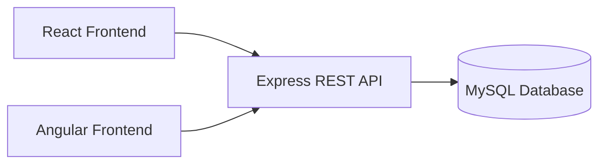
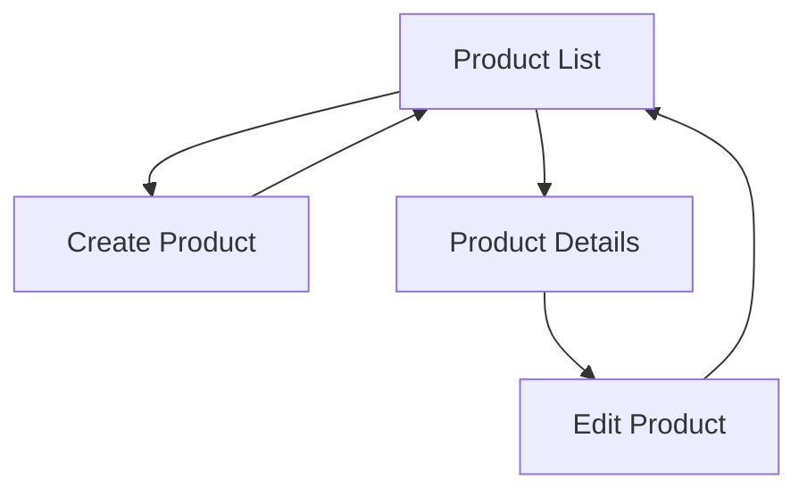
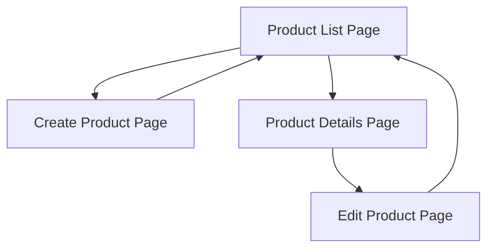
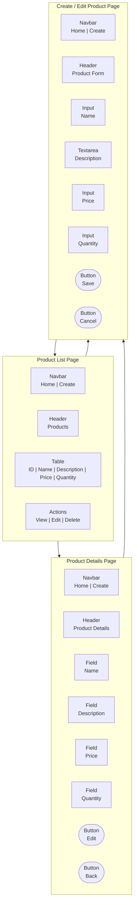
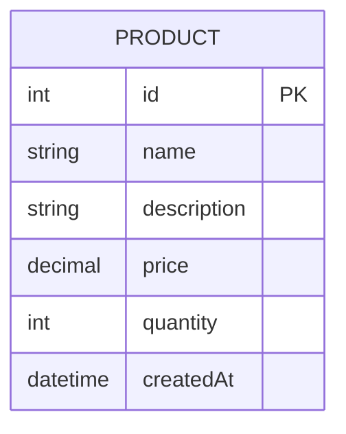
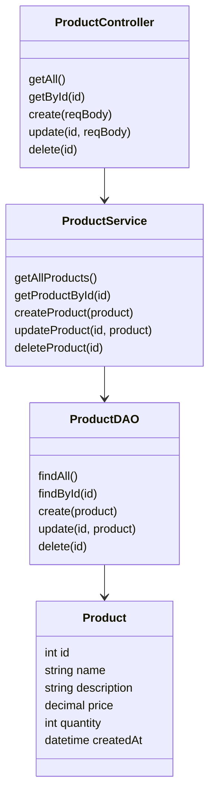

# Milestone 4 - Angular Application

**GitHub Repository URL:** https://github.com/EENGSTROM1/cst391.git  

**Author:** Eric Engstrom  
**Course:** CST 391  
**Assignment:** Milestone 4  
**Date:** February 22, 2026  

---

## Recording

The following recording demonstrates the functionality of the Milestone 4 Angular frontend integration. The screencast provides a walkthrough of the full stack application, showing how the Angular user interface interacts with the existing REST API and MySQL database.

The recording includes:

- Demonstration of the Product List page loading data from the backend
- Creating a new product using the Angular form
- Viewing product details
- Editing an existing product
- Deleting a product with immediate UI update
- Verification of database changes using MySQL Workbench
- Explanation of the application architecture and frontend integration

### Milestone 4 Screencast
[Link to Milestone 4 Angular Application – [Angular Application Video](https://www.loom.com/share/0033570ba0244d0cab18253cc36d747b)]

---

## Introduction

Milestone 4 transitions the project from backend implementation into full frontend integration. Building on the REST API developed in Milestone 3, this milestone focuses on designing and implementing a functional Angular application that consumes the existing Express and MySQL backend.

The Angular frontend provides a complete user interface for managing Product data through create, read, update, and delete operations. This milestone validates that the REST architecture supports client applications and demonstrates a working full stack web application using Angular, Express, TypeScript, and MySQL.

---

## Requirements

1. The Angular application integrates with the existing REST API.
2. The system manages a Product entity stored in a MySQL relational database.
3. The application provides create, read, update, and delete operations through the user interface.
4. The frontend is implemented using Angular standalone components.
5. The application uses Angular Router for navigation.
6. The user interface includes a Bootstrap based navigation bar.
7. The frontend communicates with the backend using HTTP requests and JSON.
8. The REST endpoints follow standard REST conventions.
9. The application demonstrates fully functional CRUD operations from the UI.
10. The design documentation aligns with the delivered software.

---

## Backend Code Structure

The backend application is organized using a layered architecture to separate concerns and improve maintainability. Each layer has a clearly defined responsibility, allowing the REST API to be easily extended and tested.

```text
milestone3/
├── src/
│   ├── app.ts
│   ├── controllers/
│   │   └── ProductController.ts
│   ├── services/
│   │   └── ProductService.ts
│   ├── dao/
│   │   └── ProductDAO.ts
│   ├── models/
│   │   └── Product.ts
│   ├── routes/
│   │   └── productRoutes.ts
│   └── db/
│       └── database.ts
├── .env
├── package.json
├── tsconfig.json
└── README.md
```

---

## Angular Project Structure

The Angular application uses standalone components and a service based structure.

```text 
milestone4/
└── productui/
    ├── src/
    │   ├── app/
    │   │   ├── app.config.ts
    │   │   ├── app.routes.ts
    │   │   ├── components/
    │   │   │   ├── product-list/
    │   │   │   ├── product-create/
    │   │   │   ├── product-edit/
    │   │   │   └── product-detail/
    │   │   ├── models/
    │   │   │   └── product.ts
    │   │   └── services/
    │   │       └── product.service.ts
    │   ├── index.html
    │   └── styles.css
    └── package.json

```

---

## Application Architecture

The following diagram illustrates the high level architecture of the application.



## Application Navigation


---

## Sitemap
The following sitemap represents the logical navigation structure of the implemented Angular application.



---

## Wireframes

These wireframes represent the structured layout of the implemented Angular application. The diagrams reflect the actual navigation structure used in Milestone 4, where the root path redirects directly to the Product List page and navigation is controlled through the application navbar.



---

## Design Updates

The overall system design remains consistent with the proposal defined in Milestone 2. The primary update for this milestone is the implementation of the backend REST API using Express and TypeScript. The Product entity, database schema, and layered architecture were implemented as designed. Minor implementation level details, such as the use of a connection pool for MySQL and basic error handling in controllers, were added to support stable operation of the API.

---

## Design Updates Summary

| Area | Update | Notes |
|-----|------|------|
| REST API | CRUD endpoints implemented | Matches Milestone 2 design |
| Backend Language | TypeScript added | Required by milestone |
| Database Access | MySQL connection pool | Improves stability |
| Error Handling | Basic validation and responses | Can be expanded later |
| Authentication | Not implemented | Out of scope for this milestone |

---

### Database Design
The application uses a single Product entity to support all required operations.



---

## Angular Routing Configuration
```ts
export const routes: Routes = [
  { path: '', redirectTo: 'products', pathMatch: 'full' },
  { path: 'products', component: ProductList },
  { path: 'create', component: ProductCreate },
  { path: 'edit/:id', component: ProductEdit },
  { path: 'view/:id', component: ProductDetail }
];
```

## UML Class Diagrams
The following UML diagram represents the implemented backend class structure.



---

## User Interface Overview

### Product List Page
- Displays all products in a Bootstrap styled table
- Provides View, Edit, and Delete actions
- Updates the UI after deletion using a local state update
- Loads product data automatically on page refresh

### Create Product Page
- Uses template driven forms
- Validates required fields
- Submits data using a POST request
- Navigates back to the Product List page after creation

### Edit Product Page
- Loads product data by ID
- Allows field updates
- Submits changes using a PUT request
- Navigates back to the Product List page after update

### Product Detail Page
- Displays full product information
- Formats price and date values for readability
- Allows navigation to the Edit page or back to the Product List page

---


## REST Endpoints

The REST API follows standard REST conventions using plural resource names and HTTP verbs to define actions.

| Method | Endpoint            | Description                          |
|-------|---------------------|--------------------------------------|
| GET   | /api/products       | Retrieve a list of all products      |
| GET   | /api/products/:id   | Retrieve a single product by ID      |
| POST  | /api/products       | Create a new product                 |
| PUT   | /api/products/:id   | Update an existing product           |
| DELETE| /api/products/:id   | Delete a product                     |

---

## API Example Requests

```json
GET /api/products
Response:
[
  {
    "id": 1,
    "name": "Gaming Mouse",
    "description": "Wireless ergonomic gaming mouse",
    "price": 59.99,
    "quantity": 25,
    "createdAt": "2026-02-01T14:22:00"
  },
  {
    "id": 2,
    "name": "Mechanical Keyboard",
    "description": "RGB mechanical keyboard",
    "price": 129.99,
    "quantity": 12,
    "createdAt": "2026-02-01T14:25:00"
  }
]
```

```json
GET /api/products/1
Response:
{
  "id": 1,
  "name": "Gaming Mouse",
  "description": "Wireless ergonomic gaming mouse",
  "price": 59.99,
  "quantity": 25,
  "createdAt": "2026-02-01T14:22:00"
}
```

```json
POST /api/products
Request:
{
  "name": "Gaming Headset",
  "description": "Surround sound headset",
  "price": 89.99,
  "quantity": 15
}

Response:
{
  "message": "Product created"
}
```

```json 
PUT /api/products/1
Request:
{
  "name": "Gaming Headset Pro",
  "description": "Updated surround sound headset",
  "price": 99.99,
  "quantity": 10
}

Response:
{
  "message": "Product updated"
}
```

```json
DELETE /api/products/1
Response:
{
  "message": "Product deleted"
}
```

---

## Risk

1. Changes to the REST API contract could impact the Angular frontend and require coordinated updates across layers.

2. Limited client side and server side validation may allow invalid or unexpected data to reach the database.

3. Lack of authentication and authorization may present security concerns if the application were deployed beyond a controlled development environment.

4. Differences in development environments, including Node version, Angular configuration, or database settings, may cause inconsistencies or deployment issues.

5. As the frontend grows in complexity, additional state management patterns may be required to maintain scalability and maintainability.

---

## Design Updates

The overall system design remains consistent with previous milestones. The primary update for this milestone is the implementation of the Angular frontend. The REST API contract remained unchanged, confirming the backend supports client applications.

Implementation updates included:

- Angular standalone component architecture  
- Template driven forms for create and edit  
- Manual change detection handling to ensure UI refresh stability  
- Local state update after delete to avoid an extra list request  
- Bootstrap based layout and navigation  

---

## Design Updates Summary

| Area | Update | Notes |
|------|--------|------|
| Frontend Framework | Angular implemented | Standalone architecture |
| Routing | Client side routing added | Clean navigation structure |
| Forms | Template driven forms | Used for create and edit |
| Change Detection | Manual trigger added | Ensures proper UI updates |
| UI Styling | Bootstrap integration | Consistent navigation and layout |
| Delete Behavior | Local list update | Immediate UI feedback |

---

## Known Issues

| Issue | Status | Notes |
|------|--------|------|
| No authentication | Out of scope | Anonymous access permitted |
| Limited validation | Basic only | Can be expanded later |
| No pagination | Not implemented | Current dataset manageable |

## Conclusion
Milestone 4 successfully integrates a fully functional Angular frontend with the backend REST API developed in Milestone 3. The application supports complete create, read, update, and delete operations through a user friendly interface. This milestone demonstrates a working full stack web application and establishes a stable foundation for testing, refinement, and final presentation in upcoming milestones.

---

# Milestone 4 PowerPoint Presentation Summary

[Download Milestone 4 PowerPoint](./milestones/milestone4/Eric_Engstrom_Milestone_4_Angular_Frontend.pptx)

## Project Overview

Milestone 4 extends the backend REST API developed in Milestone 3 by implementing a fully functional Angular frontend application. The goal of this milestone was to integrate the Angular client with the existing Express and MySQL backend to deliver a complete full stack web application.

The system now supports full Create, Read, Update, and Delete operations through a structured user interface. The Angular application consumes the REST API using HTTP requests and communicates exclusively using JSON. This milestone confirms that the backend architecture supports real client applications without requiring modifications to the API contract.

---

## Architecture Summary

The application follows a layered full stack architecture:

- Angular standalone frontend application
- Express and TypeScript REST API backend
- MySQL relational database for persistence
- JSON based communication over HTTP
- Layered backend structure separating routes, controllers, services, and data access logic

The frontend consumes REST endpoints exposed by the backend without direct database interaction. This separation of concerns ensures maintainability and scalability.

---

## Implemented Features

The following features were successfully implemented and tested:

- Product List page displaying all products in a Bootstrap styled table
- Create Product form using template driven forms
- Edit Product page with preloaded data by ID
- Delete functionality with immediate UI refresh using local state update
- Product Detail view displaying formatted product information
- Angular routing and navigation using a Bootstrap navigation bar
- Automatic data loading on page refresh

All CRUD operations were verified both through the user interface and directly within the MySQL database.

---

## Challenges Encountered

Several technical challenges were encountered during implementation:

1. Configuring Angular standalone components correctly within the application structure.
2. Resolving Angular change detection behavior that prevented automatic UI refresh in certain scenarios.
3. Managing route reuse behavior to ensure product data loads correctly when navigating between views.
4. Ensuring delete operations update the UI immediately without requiring a full page reload.
5. Maintaining consistency between documentation diagrams and actual implemented code.

Each challenge was resolved through debugging, refactoring, and alignment between frontend and backend behavior.

---

## Pending Issues and Enhancements

While the core requirements were fully implemented, the following enhancements remain outside the scope of this milestone:

- No authentication or authorization mechanism is implemented.
- Client side validation is basic and can be expanded.
- Pagination is not implemented for large datasets.
- Error handling is minimal and can be improved.
- No production deployment configuration has been completed.

These improvements can be addressed in future iterations of the application.

---

## Lessons Learned

This milestone reinforced several important software engineering principles:

- The importance of maintaining consistent REST API contracts.
- Understanding Angular change detection and routing behavior is critical for UI stability.
- A layered backend architecture significantly simplifies frontend integration.
- Clear separation of concerns improves maintainability.
- Documentation must accurately reflect the implemented system to avoid inconsistencies.

The experience gained in this milestone provides a strong foundation for future full stack development projects.

---

## Future Improvements

Future improvements that could enhance the application include:

- Adding authentication and authorization.
- Implementing stronger input validation.
- Introducing pagination and filtering.
- Improving global error handling.
- Preparing the application for production deployment.
- Adding automated testing for both frontend and backend.

---

## Conclusion

Milestone 4 successfully integrates the Angular frontend with the existing REST API backend. The system now supports full CRUD operations through a clean and structured user interface. The backend architecture proved stable and flexible, requiring no contract changes during frontend integration.

The application demonstrates a complete full stack implementation and is ready for testing, refinement, and final presentation in the upcoming milestone.

## Backend Implementation Code

### app.ts
```ts
import { Component } from '@angular/core';
import { RouterOutlet, RouterLink } from '@angular/router';

@Component({
  selector: 'app-root',
  standalone: true,
  imports: [RouterOutlet, RouterLink],
  templateUrl: './app.html',
  styleUrl: './app.css'
})
export class App {

}
```

## app.routes.ts
```ts
import { Routes } from '@angular/router';

import { ProductList } from './components/product-list/product-list';
import { ProductCreate } from './components/product-create/product-create';
import { ProductEdit } from './components/product-edit/product-edit';
import { ProductDetail } from './components/product-detail/product-detail';

export const routes: Routes = [
  { path: '', redirectTo: 'products', pathMatch: 'full' },
  { path: 'products', component: ProductList },
  { path: 'create', component: ProductCreate },
  { path: 'edit/:id', component: ProductEdit },
  { path: 'view/:id', component: ProductDetail }
];
```

## product.services.ts 
```ts 
import { Injectable } from '@angular/core';
import { HttpClient } from '@angular/common/http';
import { Observable } from 'rxjs';
import { Product } from '../models/product';

@Injectable({
  providedIn: 'root'
})
export class ProductService {

  // Must match app.use("/api/products", productRoutes) in backend
  private apiUrl = 'http://localhost:3000/api/products';

  constructor(private http: HttpClient) {}

  // GET all products
  getProducts(): Observable<Product[]> {
    return this.http.get<Product[]>(this.apiUrl);
  }

  // GET product by id
  getProduct(id: number): Observable<Product> {
    return this.http.get<Product>(`${this.apiUrl}/${id}`);
  }

  // POST create product
  createProduct(product: Product): Observable<Product> {
    return this.http.post<Product>(this.apiUrl, product);
  }

  // PUT update product
  updateProduct(id: number, product: Product): Observable<Product> {
    return this.http.put<Product>(`${this.apiUrl}/${id}`, product);
  }

  // DELETE product
  deleteProduct(id: number): Observable<void> {
    return this.http.delete<void>(`${this.apiUrl}/${id}`);
  }
}
```

## models/ product.ts
```ts
export interface Product {
  id?: number;
  name: string;
  description: string;
  price: number;
  quantity: number;
  createdAt?: Date;
}
```

## product-list.ts
```ts
import { Component, OnInit, ChangeDetectorRef } from '@angular/core';
import { Router } from '@angular/router';
import { CurrencyPipe } from '@angular/common';

import { Product } from '../../models/product';
import { ProductService } from '../../services/product.service';

@Component({
  selector: 'app-product-list',
  standalone: true,
  imports: [CurrencyPipe],
  templateUrl: './product-list.html',
  styleUrl: './product-list.css',
})
export class ProductList implements OnInit {

  products: Product[] = [];

  constructor(
    private productService: ProductService,
    private router: Router,
    private cdr: ChangeDetectorRef
  ) {}

  ngOnInit(): void {
    this.loadProducts();
  }

  loadProducts(): void {
    this.productService.getProducts().subscribe(data => {
      this.products = data;
      this.cdr.detectChanges();
    });
  }

  goToEdit(id?: number): void {
    if (!id) return;
    this.router.navigate(['/edit', id]);
  }

  goToView(id?: number): void {
    if (!id) return;
    this.router.navigate(['/view', id]);
  }

  deleteProduct(id?: number): void {
    if (!id) return;

    const confirmDelete = confirm('Delete this product?');
    if (!confirmDelete) return;

    this.productService.deleteProduct(id).subscribe(() => {

      // Remove item locally for instant UI update
      this.products = this.products.filter(p => p.id !== id);

      // Force view refresh
      this.cdr.detectChanges();
    });
  }
}
```

## product-edit.ts
```ts
import { Component, OnInit, ChangeDetectorRef } from '@angular/core';
import { ActivatedRoute, Router } from '@angular/router';
import { FormsModule } from '@angular/forms';
import { CommonModule } from '@angular/common';

import { Product } from '../../models/product';
import { ProductService } from '../../services/product.service';

@Component({
  selector: 'app-product-edit',
  standalone: true,
  imports: [CommonModule, FormsModule],
  templateUrl: './product-edit.html',
  styleUrl: './product-edit.css',
})
export class ProductEdit implements OnInit {

  product: Product = {
    id: 0,
    name: '',
    description: '',
    price: 0,
    quantity: 0
  };

  constructor(
    private route: ActivatedRoute,
    private router: Router,
    private productService: ProductService,
    private cdr: ChangeDetectorRef
  ) {}

  ngOnInit(): void {
    const id = Number(this.route.snapshot.paramMap.get('id'));

    this.productService.getProduct(id).subscribe(data => {
      this.product = data;
      this.cdr.detectChanges();
    });
  }

  update(): void {
    if (!this.product.id) return;

    this.productService.updateProduct(this.product.id, this.product)
      .subscribe(() => {
        this.router.navigate(['/products']);
      });
  }

  cancel(): void {
    this.router.navigate(['/products']);
  }
}
```

## product-detail.ts
```ts
import { Component, OnInit, ChangeDetectorRef } from '@angular/core';
import { ActivatedRoute, Router } from '@angular/router';
import { CommonModule, CurrencyPipe } from '@angular/common';

import { Product } from '../../models/product';
import { ProductService } from '../../services/product.service';

@Component({
  selector: 'app-product-detail',
  standalone: true,
  imports: [CommonModule, CurrencyPipe],
  templateUrl: './product-detail.html',
  styleUrl: './product-detail.css',
})
export class ProductDetail implements OnInit {

  product?: Product;

  constructor(
    private route: ActivatedRoute,
    private router: Router,
    private productService: ProductService,
    private cdr: ChangeDetectorRef
  ) {}

  ngOnInit(): void {
    const id = Number(this.route.snapshot.paramMap.get('id'));

    this.productService.getProduct(id).subscribe(data => {
      this.product = data;
      this.cdr.detectChanges();
    });
  }

  edit(): void {
    if (!this.product?.id) return;
    this.router.navigate(['/edit', this.product.id]);
  }

  back(): void {
    this.router.navigate(['/products']);
  }
}
```

## product-create.ts
```ts
import { Component } from '@angular/core';
import { Router } from '@angular/router';
import { FormsModule } from '@angular/forms';
import { Product } from '../../models/product';
import { ProductService } from '../../services/product.service';
import { CommonModule } from '@angular/common';

@Component({
  selector: 'app-product-create',
  standalone: true,
  imports: [CommonModule, FormsModule],
  templateUrl: './product-create.html',
  styleUrl: './product-create.css',
})
export class ProductCreate {

  product: Product = {
    name: '',
    description: '',
    price: 0,
    quantity: 0
  };

  constructor(
    private productService: ProductService,
    private router: Router
  ) {}

  save(): void {
    this.productService.createProduct(this.product).subscribe(() => {
      this.router.navigate(['/']);
    });
  }

  cancel(): void {
    this.router.navigate(['/']);
  }
}
```