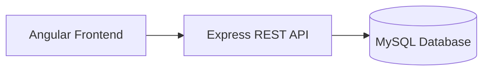
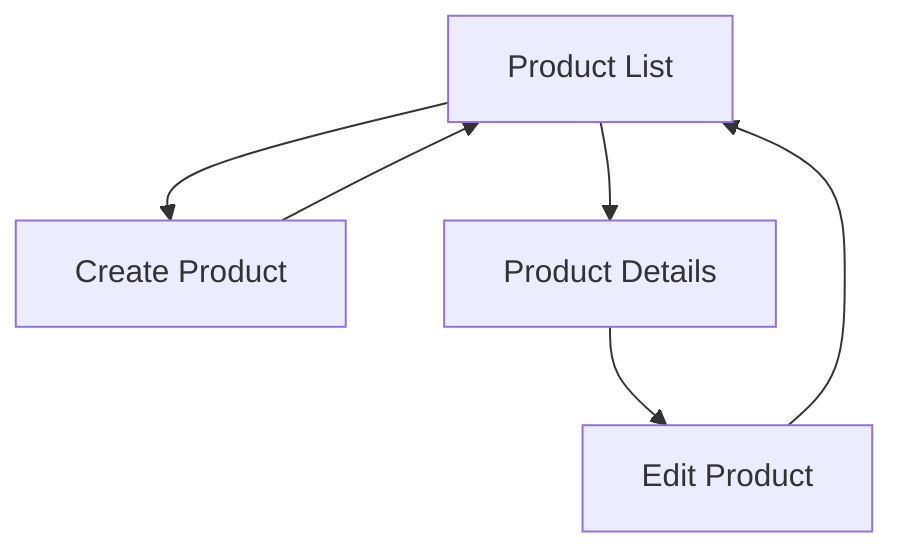
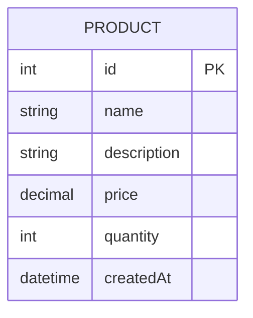
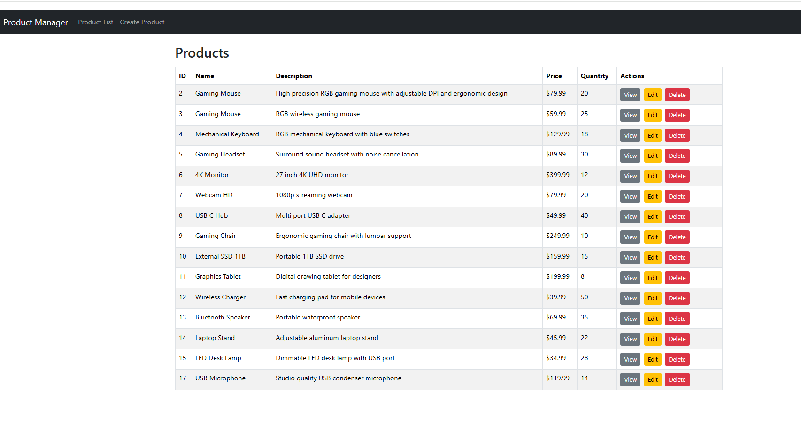
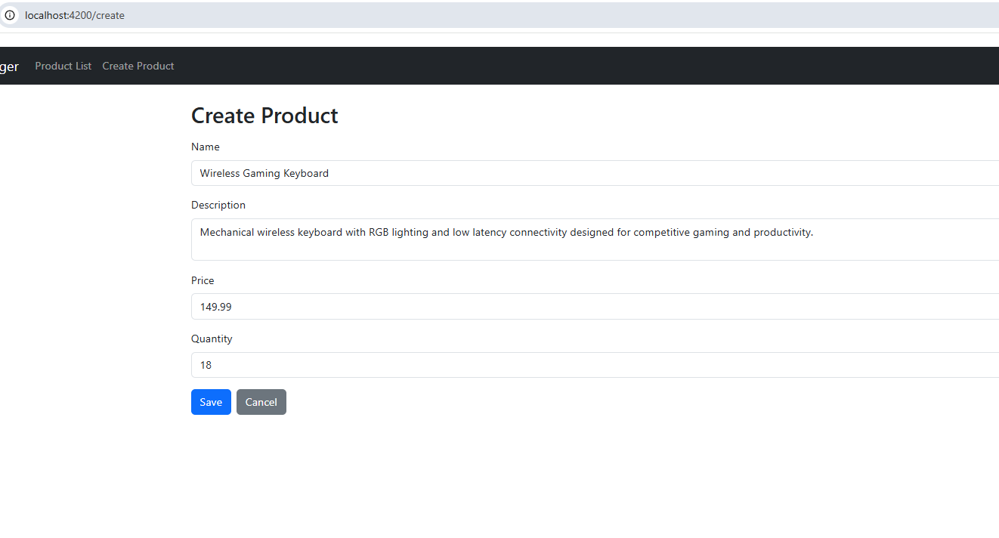
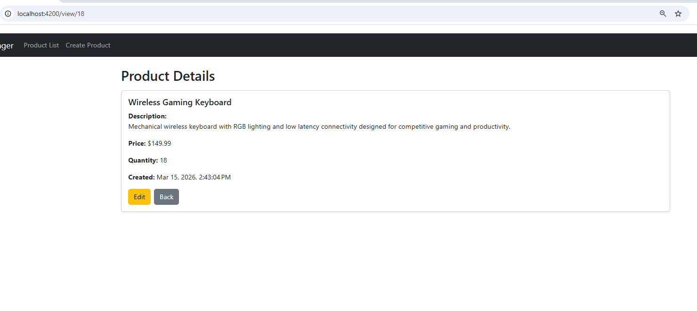
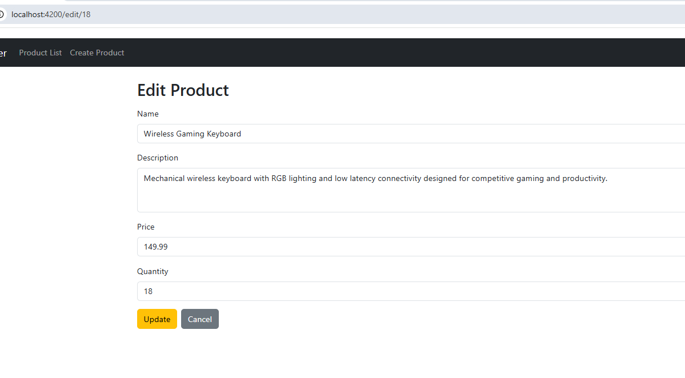

# Milestone 5 - Angular Frontend CRUD Application

**GitHub Repository URL:** https://github.com/EENGSTROM1/cst391.git  

**Author:** Eric Engstrom  
**Course:** CST 391  
**Assignment:** Milestone 5  
**Date:** March 15, 2026  

---

# Table of Contents

1. Recording  
2. Introduction  
3. Requirements  
4. Backend Code Structure  
5. Angular Project Structure  
6. Application Architecture  
7. Application Navigation  
8. Database Design  
9. User Interface Demonstration  
10. REST Endpoints  
11. Design Updates  
12. Known Issues  
13. Risks  
14. Conclusion  
15. PowerPoint Summary  
16. Git Repository  

---

# Recording

The following recording demonstrates the functionality of the Milestone 5 Angular frontend application. The screencast walks through the complete system and shows how the Angular user interface communicates with the backend REST API.

The recording demonstrates the complete CRUD workflow from the perspective of the user interface.

The recording includes:

- Application navigation using Angular Router
- Product list retrieval from the backend API
- Creating a new product using the Angular form
- Viewing product details
- Editing an existing product
- Deleting a product
- Demonstrating how UI updates occur after CRUD operations

### Milestone 5 Screencast

[[Milestone 5 Recording](https://www.loom.com/share/4facb852b3d94617833a4c3ba387797d)]

---

# Introduction

Milestone 5 focuses on demonstrating a fully functional Angular frontend application integrated with the backend REST API developed in earlier milestones. The objective of this milestone is to confirm that the backend architecture supports real client applications while providing a user friendly interface for managing product data.

The Angular application communicates with the backend using HTTP requests and JSON responses. Through this interface, users can perform create, read, update, and delete operations on Product records stored in the MySQL database.

This milestone demonstrates a complete full stack web application using Angular, Express, TypeScript, and MySQL.

---

# Requirements

1. The Angular frontend integrates with the existing REST API.
2. The system manages Product records stored in MySQL.
3. The application supports create, read, update, and delete operations.
4. Angular standalone components are used for frontend architecture.
5. Angular Router manages page navigation.
6. Bootstrap provides user interface styling.
7. The frontend communicates with the backend using HTTP and JSON.
8. REST endpoints follow standard REST conventions.
9. CRUD operations are demonstrated through the user interface.
10. Documentation reflects the implemented system design.

---

# Backend Code Structure

The backend application remains structured using a layered architecture that separates responsibilities between controllers, services, and database access layers.

```
milestone3/
├── src/
│   ├── app.ts
│   ├── controllers/
│   │   └── ProductController.ts
│   ├── services/
│   │   └── ProductService.ts
│   ├── dao/
│   │   └── ProductDAO.ts
│   ├── models/
│   │   └── Product.ts
│   ├── routes/
│   │   └── productRoutes.ts
│   └── db/
│       └── database.ts
```

---

# Angular Project Structure

```
milestone5/
└── productui/
    ├── src/
    │   ├── app/
    │   │   ├── app.routes.ts
    │   │   ├── components/
    │   │   │   ├── product-list/
    │   │   │   ├── product-create/
    │   │   │   ├── product-edit/
    │   │   │   └── product-detail/
    │   │   ├── models/
    │   │   │   └── product.ts
    │   │   └── services/
    │   │       └── product.service.ts
    │   └── index.html
```

---

# Application Architecture



---

# Application Navigation



---

# Database Design



---

# User Interface Demonstration

The following screenshots demonstrate the Angular application interface and the implemented CRUD operations.

---

## Product List Page

The Product List page retrieves all products from the backend API and displays them in a Bootstrap styled table. Users can view, edit, or delete products directly from this page.



---

## Create Product Page

The Create Product page allows users to add new products to the system. The form collects product information and sends a POST request to the REST API.



---

## Product Details Page

The Product Details page displays complete information for a selected product. The Angular service retrieves the product data from the backend API using the product ID.



---

## Edit Product Page

The Edit Product page allows users to modify existing product information. The updated data is submitted to the backend API using a PUT request.



---

## Delete Product Confirmation

The Delete operation allows users to remove products from the system. A confirmation dialog appears before the deletion occurs to prevent accidental removal.


---

# REST Endpoints

| Method | Endpoint | Description |
|------|------|------|
| GET | /api/products | Retrieve all products |
| GET | /api/products/:id | Retrieve a product by ID |
| POST | /api/products | Create a new product |
| PUT | /api/products/:id | Update an existing product |
| DELETE | /api/products/:id | Delete a product |

---

# Design Updates

The overall system design remains consistent with previous milestones. The primary update in Milestone 5 is the demonstration of the complete Angular frontend application and its integration with the backend REST API.

Enhancements implemented include:

- Angular service layer for API communication
- Template driven forms for create and edit operations
- Angular router navigation between views
- Bootstrap styling for improved UI layout
- Immediate UI updates after delete operations
- Confirmation dialogs for destructive actions

---

# Known Issues

| Issue | Status | Notes |
|------|------|------|
| Authentication not implemented | Out of scope | Public access allowed |
| Form validation limited | Basic validation only | Can be expanded |
| Pagination not implemented | Small dataset | Could be added later |
| Error handling minimal | Development stage | Can be improved |

---

# Risks

1. Changes to the REST API contract may require updates to the Angular service layer.
2. Limited validation may allow invalid data to reach the backend.
3. Lack of authentication may present security risks in a production environment.
4. Environmental configuration differences could affect deployment.
5. Large datasets may require pagination or filtering in the future.

---

# Conclusion

Milestone 5 successfully demonstrates a complete Angular frontend application integrated with the backend REST API. The application supports full create, read, update, and delete operations through a structured and user friendly interface.

The frontend communicates with the backend through an Angular service layer using HTTP requests. This milestone validates that the full stack architecture supports real user interactions and establishes a stable foundation for testing and final presentation.

---

# PowerPoint Presentation

[Download Milestone 5 PowerPoint](./milestones/milestone5/Eric_Engstrom_Milestone_5_Angular_CRUD.pptx)

---

# PowerPoint Overview

## Project Overview

Milestone 5 demonstrates a fully functional Angular frontend integrated with a REST API backend to manage product data.

## Architecture Summary

The application architecture consists of:

- Angular frontend
- Express REST API backend
- MySQL relational database
- JSON communication via HTTP

## Implemented Features

- Product list display
- Create product form
- Product details page
- Edit product functionality
- Delete confirmation
- Angular router navigation
- Bootstrap styled UI

## Challenges Encountered

- Configuring Angular standalone components
- Managing Angular change detection behavior
- Ensuring UI refresh after delete operations
- Maintaining documentation alignment with code

## Future Improvements

- Add authentication
- Improve validation
- Add pagination and filtering
- Improve global error handling

---

# Git Repository

GitHub Repository  
https://github.com/EENGSTROM1/cst391