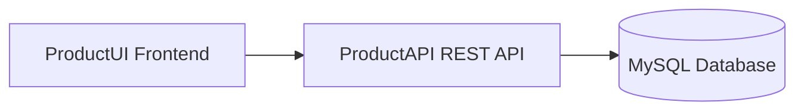
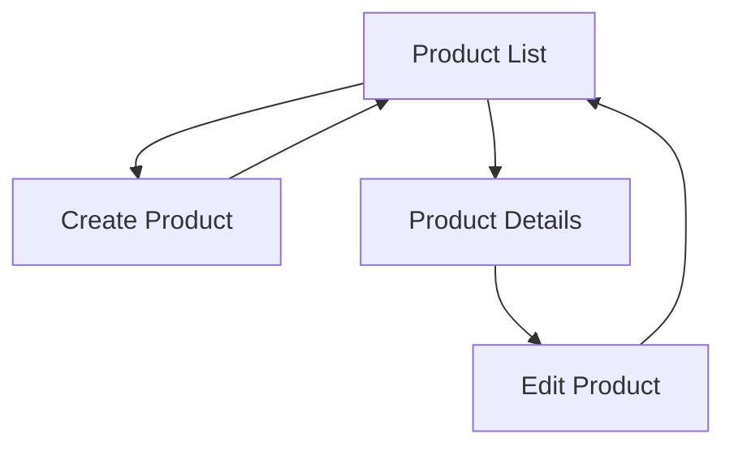
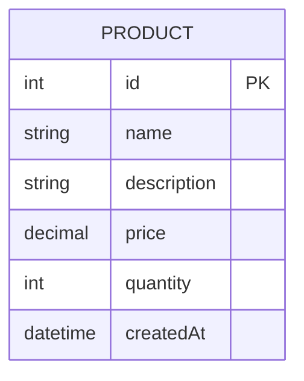
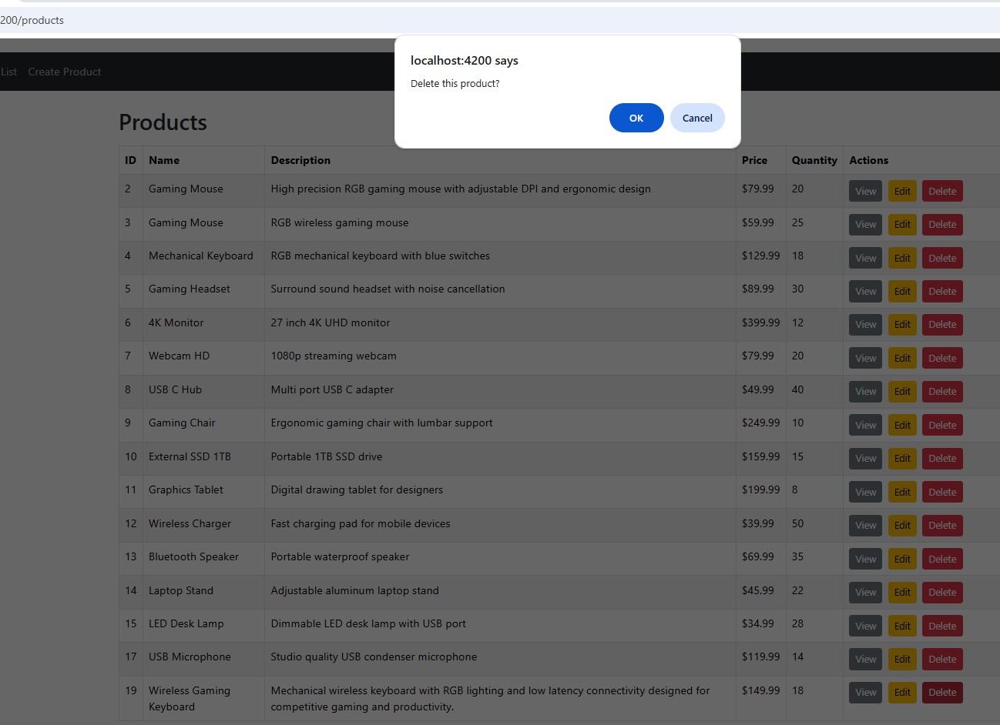

# Milestone 6 - Final Presentation and Full Stack Demonstration

**GitHub Repository URL:** https://github.com/EENGSTROM1/cst391.git  

**Author:** Eric Engstrom  
**Course:** CST 391  
**Assignment:** Milestone 6  
**Date:** March 2026  

---

# Table of Contents

1. Recording  
2. Introduction  
3. Requirements  
4. Backend Code Structure  
5. Angular Project Structure  
6. Application Architecture  
7. Application Navigation  
8. Database Design  
9. User Interface Demonstration  
10. REST Endpoints  
11. Design Updates  
12. Accessibility and User Experience  
13. Known Issues  
14. Risks  
15. Conclusion  
16. PowerPoint Summary  
17. Git Repository  

---

# Recording

The following recordings demonstrate both the final presentation and the complete functionality of the application.

The first recording provides a full technical walkthrough using the PowerPoint presentation. The second recording demonstrates the complete CRUD functionality of the ProductUI application interacting with the ProductAPI backend.

Together, these recordings represent a complete end to end system demonstration.

### Screencast Links

[[PowerPoint Recording](https://www.loom.com/share/522e9c33692f4e7fbd21f2633280ca6d)]

[[Milestone 5 Recording](https://www.loom.com/share/4facb852b3d94617833a4c3ba387797d)]

---

# Introduction

Milestone 6 represents the final stage of the project where all previous milestones are combined into one complete and professional presentation. The goal of this milestone is to demonstrate a fully functional full stack web application and clearly explain how each component works together.

The application is a product management system that allows users to perform create, read, update, and delete operations on product data. The system consists of a ProductUI frontend built with Angular and a ProductAPI backend built with Node.js and Express.

This milestone focuses on presenting the system as a complete solution while demonstrating both technical understanding and functionality.

---

# Requirements

1. Combine all previous milestone work into one final presentation  
2. Demonstrate full application functionality  
3. Explain frontend and backend architecture  
4. Show CRUD operations  
5. Demonstrate application navigation  
6. Show the effect of CRUD operations in the UI  
7. Include accessibility discussion  
8. Provide a professional presentation walkthrough  
9. Submit PowerPoint and screencast links  
10. Ensure documentation reflects the final system  

---

# Backend Code Structure

The backend follows a layered architecture that separates concerns between controllers, services, and data access.

```
milestone3/
├── src/
│   ├── app.ts
│   ├── controllers/
│   │   └── ProductController.ts
│   ├── services/
│   │   └── ProductService.ts
│   ├── dao/
│   │   └── ProductDAO.ts
│   ├── models/
│   │   └── Product.ts
│   ├── routes/
│   │   └── productRoutes.ts
│   └── db/
│       └── database.ts
```

---

# Angular Project Structure

```
milestone5/
└── productui/
    ├── src/
    │   ├── app/
    │   │   ├── app.routes.ts
    │   │   ├── components/
    │   │   │   ├── product-list/
    │   │   │   ├── product-create/
    │   │   │   ├── product-edit/
    │   │   │   └── product-detail/
    │   │   ├── models/
    │   │   │   └── product.ts
    │   │   └── services/
    │   │       └── product.service.ts
    │   └── index.html
```

---

# Application Architecture



---

# Application Navigation



---

# Database Design



---

# User Interface Demonstration

The following screenshots demonstrate the Angular ProductUI interface and its CRUD functionality.

---

## Product List Page

The Product List page retrieves all products from the backend API and displays them in a structured table. Users can view, edit, or delete products directly from this page.


---

## Create Product Page

The Create Product page allows users to input new product information using a form. When submitted, the data is sent to the backend API using a POST request.


---

## Product Details Page

The Product Details page displays full information for a selected product retrieved from the backend API.


---

## Edit Product Page

The Edit Product page allows users to modify existing product information. Changes are sent to the backend using a PUT request.


---

## Delete Product Confirmation

The Delete operation removes a product from the system using a DELETE request and updates the UI.



---

# REST Endpoints

| Method | Endpoint | Description |
|------|------|------|
| GET | /api/products | Retrieve all products |
| GET | /api/products/:id | Retrieve a product by ID |
| POST | /api/products | Create a new product |
| PUT | /api/products/:id | Update an existing product |
| DELETE | /api/products/:id | Delete a product |

---

# Design Updates

Milestone 6 combines all previous work into a finalized system and presentation.

- Integrated frontend and backend into a complete application  
- Created final PowerPoint presentation  
- Added accessibility discussion  
- Provided full system demonstration through recordings  
- Improved documentation clarity  

---

# Accessibility and User Experience

Accessibility is a key responsibility in web development. From a Christian worldview perspective, it reflects treating all users with dignity and fairness.

Best practices include:

- Clear and readable text  
- Strong color contrast  
- Properly labeled form inputs  
- Keyboard navigation support  
- Logical layout and structure  

---

# Known Issues

| Issue | Status | Notes |
|------|------|------|
| Authentication not implemented | Out of scope | Public access allowed |
| Form validation limited | Basic validation | Can be improved |
| Pagination not implemented | Small dataset | Future improvement |
| Error handling minimal | Development stage | Expand later |

---

# Risks

1. API changes may impact frontend functionality  
2. Limited validation may allow incorrect data  
3. Lack of authentication presents security risks  
4. Deployment differences may cause issues  
5. Large datasets may require optimization  

---

# Conclusion

Milestone 6 demonstrates a complete full stack product management system. The ProductUI and ProductAPI work together to support CRUD operations and provide a seamless user experience.

This milestone highlights both technical development and the ability to present and explain a system professionally.

---

# PowerPoint Summary

## Project Overview

Full stack product management system using Angular frontend and Express backend.

## Architecture Summary

- ProductUI frontend  
- ProductAPI backend  
- MySQL database  
- REST communication  

## Features

- Product list  
- Create product  
- Product details  
- Edit product  
- Delete product  
- Navigation and routing  

## Challenges

- API integration  
- UI updates after CRUD operations  
- Routing configuration  
- State management  

## Future Improvements

- Authentication  
- Validation  
- Pagination  
- Error handling  

---

# Git Repository

GitHub Repository  
https://github.com/EENGSTROM1/cst391

---

---

# PowerPoint Presentation Content (Milestone 6)


## Slide 1: ProductUI

**ProductUI and ProductAPI Final Presentation**  
Eric Engstrom  
CST 391 JavaScript Web Application Development  
Milestone 6  

---

## Slide 2: Project Overview

This project is a full stack product management application designed to allow users to manage product data through a web based interface. The system is composed of two main components: a frontend ProductUI built using Angular and a backend ProductAPI built using Node.js and Express.

The purpose of this project is to demonstrate how a distributed web application functions, where the frontend and backend operate independently but communicate through RESTful API calls. The system supports full CRUD operations and provides a user friendly way to interact with product data.

---

## Slide 3: Project Purpose

The goal of this project was to build a functional product management system that simulates a real world inventory style application. Users are able to interact with product records directly from the UI, while the backend handles data processing and storage.

This project demonstrates core concepts such as frontend and backend separation, REST API design, component based architecture, and dynamic user interface updates based on user interaction.

---

## Slide 4: Technologies Used

The application uses a modern web development stack that includes Angular for building the frontend user interface and Node.js with Express for creating the backend REST API.

Axios is used for handling HTTP communication between the frontend and backend, while Angular Router is used to manage navigation between different pages. The system follows RESTful architecture principles and uses JSON as the format for data exchange.

---

## Slide 5: Frontend Architecture (ProductUI)

The ProductUI is built using Angular and follows a component based architecture. Each part of the application, such as the product list, create form, edit form, and detail view, is organized into reusable components.

The frontend uses state management to handle data updates and Angular services to communicate with the backend API. Routing is implemented using Angular Router, allowing users to navigate between pages without reloading the application. This results in a smooth and responsive user experience.

---

## Slide 6: Backend Architecture (ProductAPI)

The ProductAPI is built using Node.js and Express and is responsible for handling all data related operations. It follows a layered architecture that separates responsibilities between controllers, services, and data access objects.

The backend exposes REST endpoints that support GET, POST, PUT, and DELETE operations. These endpoints allow the frontend to retrieve product data, create new records, update existing records, and delete records. The backend processes requests and returns JSON responses to the frontend.

---

## Slide 7: CRUD Functionality

The application supports full CRUD functionality. Users can create new products by submitting a form, read product data by viewing the product list and details, update existing products using an edit form, and delete products from the system.

Each action performed in the UI triggers an HTTP request to the backend API. The backend processes the request and returns updated data, which is then used to refresh the UI. This ensures that the interface always reflects the current state of the system.

---

## Slide 8: Navigation and Routing

Navigation within the application is handled using Angular Router. Users can move between different pages such as the product list, create product page, product details page, and edit product page.

Routing allows the application to behave like a single page application, where content updates dynamically without requiring a full page reload. This improves performance and provides a more seamless user experience.

---

## Slide 9: End to End Communication

One of the key aspects of this project is the communication between the frontend and backend. When a user interacts with the ProductUI, the frontend sends an HTTP request to the ProductAPI using Axios.

The backend processes the request and returns a JSON response. The frontend then updates the UI based on the response data. This demonstrates a complete end to end workflow where both systems work together to deliver functionality.

---

## Slide 10: Accessibility and Christian Worldview

Accessibility is an important consideration in web development. From a Christian worldview perspective, developers have a responsibility to treat all users with dignity and fairness by creating applications that are accessible to everyone.

Accessibility improves user experience by reducing barriers and making applications easier to navigate and understand. Best practices include using clear text, strong color contrast, properly labeled inputs, keyboard navigation support, and layouts that are compatible with assistive technologies.

---

## Slide 11: Challenges and Lessons Learned

Throughout the development of this project, several challenges were encountered. These included connecting the frontend to the backend API, debugging HTTP requests and responses, managing application state after CRUD operations, and configuring routing correctly.

Working through these challenges helped improve problem solving skills and provided a deeper understanding of how full stack applications function. It also reinforced the importance of testing and debugging during development.

---

## Slide 12: Demonstration Summary

The full demonstration of the application includes navigating through the ProductUI, viewing product data, creating new products, updating existing products, and deleting products.

Since the functionality of the application has not changed from the previous milestone, the prior demonstration recording is reused to show the complete system in action. This recording highlights the effect of each CRUD operation within the user interface.

---

## Slide 13: Conclusion

In conclusion, this project demonstrates the ability to design, build, and present a full stack product management application. It shows how frontend and backend systems communicate, how CRUD operations are implemented, and how a complete user experience is delivered.

The final system reflects real world development practices and demonstrates readiness to apply these skills in a professional environment.

---